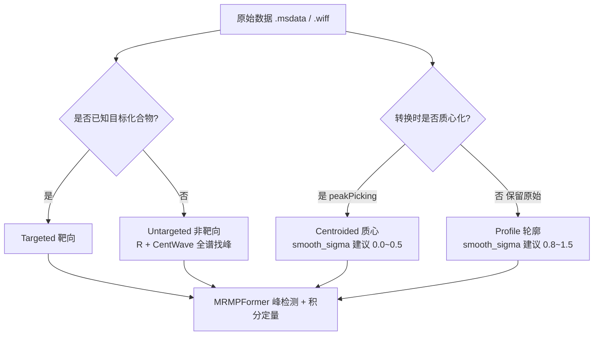

# User_Tutorials.md — MRMPFormer 四种分析模式教程

> 本文面向使用 MRMPFormer 进行 LC-MS 色谱峰检测与定量的用户，专业介绍
> **Targeted / Untargeted × Centroided / Profile** 四种组合分析模式的
> 原理、适用场景、操作流程与参数建议。
>
> 所有命令均以 `model/` 为工作目录，权重文件 `checkpoint/checkpoint0029.pth` 需置于 `model/checkpoint/` 下。

---

## 1. 总览：2 × 2 组合模式

MRMPFormer 的分析流程由两个正交维度决定：

| 维度 | 选项 | 决定的问题 |
|------|------|------------|
| **分析策略** | Targeted（靶向） / Untargeted（非靶向） | "检测哪些化合物"是否已知 |
| **数据形态** | Centroided（质心） / Profile（轮廓） | 输入 mzML 中谱图点的形态 |

四种组合：

| # | 组合 | 典型场景 |
|---|------|----------|
| 1 | Targeted × Centroided | MRM/SRM 已知化合物定量（最常用） |
| 2 | Targeted × Profile | 高分辨原始轮廓数据上的已知化合物定量 |
| 3 | Untargeted × Centroided | 质心化全扫描数据的非靶向代谢组学 |
| 4 | Untargeted × Profile | 轮廓化全扫描数据的非靶向代谢组学（CentWave 经典用法） |



---

## 2. 维度一：Targeted vs Untargeted

### 2.1 Targeted（靶向分析）

**定义**：目标化合物已知，只需对指定母离子/子离子（transition，Q1→Q3）的通道进行峰检测与定量。

**数据流**（代码事实）：

1. 仪器方法中已定义 chromatogram 通道（每通道一个 Q1/Q3 组合）
2. `testXIC.py::extract_xic_with_pyopenms` 逐通道提取 XIC：
   - 按 `(Q1, Q3)` 去重，跳过重复通道
   - 可选高斯平滑（`smooth_sigma`）
   - QC 剔除：RT 点数 `< --pipeline_min_chrom_points`（默认 10）或平滑后最高强度 `< --pipeline_min_max_intensity`（默认 1000）的通道
   - ROI 窗口以该通道**平滑后最高峰 RT 为中心 ±1 min**，生成 400×300 图像
   - 自动写出 `feature.csv`（Compound Name / mz / RT / q3）、`roi_windows.csv`、`xic_matrix.npy`
3. `newtest.py` 读 ROI 图像 + `feature.csv`，运行 MRMPFormer 预测峰框
4. SNR 筛选（框外信噪比）→ 峰区间精修（post_newtest）→ `prediction_refined.csv`

**命令**：

```bash
cd model
python main.py --mode pipeline_batch_mzml \
  --model checkpoint/checkpoint0029.pth \
  --batch_dir ../data/test1/mzML \
  --output_dir ../output/targeted \
  --threshold 0.99 --plot \
  --snr_min 3.0 \
  --pipeline_min_max_intensity 1000 \
  --pipeline_min_chrom_points 10
```

### 2.2 Untargeted（非靶向分析）

**定义**：目标化合物未知，先对全谱数据进行无先验峰检测（xcms CentWave），再对找到的每个峰提取 EIC、识别与定量。

**数据流**（代码事实）：

1. **全谱峰检测**：`getFeature.py` 调用 R 脚本 `find_peaks.R`（xcms `CentWave` 算法）对 mzML 目录做全谱峰检测，输出 `peak_list.csv`（Compound Name / mz / RT），保存于 `--source` 目录的**父目录**：
   ```bash
   cd model
   python getFeature.py \
     --source resources/example/centroided \
     --polarity positive --ppm 10 \
     --minWidth 5 --maxWidth 50 \
     --s2n 5 --noise 100 \
     --mzDiff 0.015 --prefilter 3
   ```
   | 参数 | 默认 | 含义 |
   |------|------|------|
   | `--ppm` | 10 | MS1 m/z 容差（ppm） |
   | `--minWidth` / `--maxWidth` | 5 / 50 | CentWave 峰宽范围（秒） |
   | `--s2n` | 5 | 信噪比阈值 |
   | `--noise` | 100 | 噪声阈值 |
   | `--mzDiff` | 0.015 | m/z 差异阈值 |
   | `--prefilter` | 3 | 预过滤阈值 |

2. **EIC 提取 + ROI 生成**：按 `peak_list.csv` 的 m/z 从原始 mzML 提取各峰 EIC 数组，整理为 JSON（每化合物 `{mz_name, rt, intensity, q3?}`），经 `testXIC.py --from_json` 生成 ROI：
   ```bash
   python testXIC.py \
     --from_json ../output/untargeted_eic.json \
     --output_dir ../output/untargeted_roi \
     --smooth_sigma 0.0
   ```

3. **模型预测**：对 ROI 目录运行批量预测：
   ```bash
   python main.py --mode batch_dir \
     --model checkpoint/checkpoint0029.pth \
     --batch_dir ../output/untargeted_roi \
     --output_dir ../output/untargeted_pred
   ```

4. （可选）SNR 筛选与精修：`python -m tools.batch.reprocess --stage snr/post`

> 💡 另一条等价路径：若样品目录已备好 `feature.csv` + `xic_matrix.npy`，可用
> `python run_unified_peak_workflow.py predict_from_ref_rt --sample_xic_dir <目录> --model ... --output_dir ...`
> 一步完成 ROI 生成 + 预测。

### 2.3 feature.csv 格式规范（两模式通用）

加载器 `mrmpformer/util/io.py::load_features` 要求：

| 列名 | 必填 | 说明 |
|------|------|------|
| `Compound Name` | ✅ | 化合物名（加载时特殊字符 `: ( ) （ ）` 会被替换为 `_`，并按自然排序） |
| `mz` | ✅ | 母离子 m/z |
| `RT` | ✅ | 保留时间（分钟） |
| `q3` | 可选 | 子离子 m/z（MRM transition 用） |
| `native_id` | 可选 | 与 mzML chromatogram id 对应，用于区分 transition |

---

## 3. 维度二：Centroided vs Profile

### 3.1 概念

| | Centroided（质心） | Profile（轮廓） |
|---|---|---|
| 本质 | 峰检测后每个峰只保留质心点（m/z + 峰高） | 仪器原始连续扫描信号，完整钟形峰形 |
| 数据量 | 小 | 大 |
| 点密度 | 稀疏 | 密集 |
| 噪声 | 已去除大部分 | 保留原始噪声 |

### 3.2 转换工具控制（`converters/wiff.py`）

```bash
cd converters
python wiff.py                    # 默认：--filter "peakPicking true 1-" → 质心化输出
python wiff.py --no-peak-picking  # 跳过峰检测 → 保留 profile 原始轮廓
```

`msdata.py`（OpenMS 工具链）输出的形态由 `msdata2mzml.exe` 决定，通常为轮廓数据，可后续按需处理。

### 3.3 `smooth_sigma` 建议

高斯平滑作用于 XIC 强度序列，直接决定模型输入图像质量：

| 数据形态 | `smooth_sigma` 建议 | 理由 |
|----------|--------------------|------|
| Centroided | `0.0` ~ `0.5` | 点稀疏且已去噪，过度平滑会拉低/合并峰 |
| Profile | `0.8` ~ `1.5` | 点密集含噪，需平滑压制高频噪声后再定位峰顶 |

---

## 4. 模式一：Targeted × Centroided（推荐生产模式）

**场景**：MRM/SRM 已知化合物定量、标准曲线、方法学验证（回收率/精密度/线性）。

**操作**：

```bash
cd model
python main.py --mode pipeline_batch_mzml \
  --model checkpoint/checkpoint0029.pth \
  --batch_dir ../data/test1/mzML \
  --output_dir ../output/t1_centroided \
  --threshold 0.99 --plot \
  --smooth_sigma 0.0 \
  --snr_min 3.0 \
  --pipeline_min_max_intensity 1000 \
  --pipeline_min_chrom_points 10
```

**输出**：`<output>/snr_filtered/<样品>/SNR_box_3.0/prediction_refined.csv`（⭐ 最终峰面积 + 置信度）。

**要点**：
- 仪器方法通道即分析对象，无需准备 feature.csv（自动生成）
- 质心数据不平滑或轻平滑（`0.0~0.5`）

---

## 5. 模式二：Targeted × Profile

**场景**：仪器导出的高分辨原始轮廓数据（如 `wiff.py --no-peak-picking` 转换结果），需要完整峰形进行边界精修。

**操作**：命令同模式一，仅调整平滑参数：

```bash
python main.py --mode pipeline_batch_mzml \
  --model checkpoint/checkpoint0029.pth \
  --batch_dir ../data/test1/mzML_profile \
  --output_dir ../output/t1_profile \
  --threshold 0.99 --plot \
  --smooth_sigma 1.0 \
  --snr_min 3.0
```

**要点**：
- `smooth_sigma` 建议 `0.8~1.5`，峰边界精修（post_newtest）在平滑后 XIC 上进行
- 轮廓数据量较大，转换与 EIC 提取耗时更长

---

## 6. 模式三：Untargeted × Centroided

**场景**：质心化全扫描数据的代谢组学发现（找未知峰、差异代谢物初筛）。

**操作**：

```bash
cd model
# 步骤 1：CentWave 全谱峰检测（输出 peak_list.csv 到 source 的父目录）
python getFeature.py \
  --source ../data/fullscan_centroided \
  --polarity positive --ppm 10 \
  --minWidth 5 --maxWidth 50 \
  --s2n 5 --noise 100 --mzDiff 0.015 --prefilter 3

# 步骤 2：按 peak_list 各 m/z 从原始 mzML 提取 EIC，生成 JSON 后做 ROI
python testXIC.py \
  --from_json ../output/eic_arrays.json \
  --output_dir ../output/u3_roi \
  --smooth_sigma 0.0

# 步骤 3：批量预测
python main.py --mode batch_dir \
  --model checkpoint/checkpoint0029.pth \
  --batch_dir ../output/u3_roi \
  --output_dir ../output/u3_pred \
  --threshold 0.99 --plot
```

**要点**：
- 需安装 R + Bioconductor（`xcms`、`MSnbase`、`dplyr`），详见 README「Untargeted 模式」
- CentWave 的 `minWidth/maxWidth` 需与实际峰宽匹配（宽峰加大 `maxWidth`）

---

## 7. 模式四：Untargeted × Profile

**场景**：标准非靶向代谢组学流程——CentWave 的经典使用对象就是轮廓数据（峰形完整，峰检测更准）。

**操作**：与模式三相同，差异在：
- 转换时用 `python wiff.py --no-peak-picking` 保留轮廓
- 步骤 2 的 `--smooth_sigma` 用 `0.8~1.5`
- CentWave 参数可适当放宽 `--minWidth`（轮廓数据峰形更宽）

---

## 8. 模式选择速查

| 你的情况 | 选择模式 | 关键参数 |
|----------|----------|----------|
| 已知化合物列表 / MRM 方法，质心数据 | **1. Targeted × Centroided** | `smooth_sigma 0.0` |
| 已知化合物，高分辨原始轮廓数据 | **2. Targeted × Profile** | `smooth_sigma 1.0` |
| 未知化合物，质心全扫描 | **3. Untargeted × Centroided** | CentWave + `smooth_sigma 0.0` |
| 未知化合物，轮廓全扫描 | **4. Untargeted × Profile** | CentWave + `smooth_sigma 1.0` |

---

## 9. 常见问题

**Q1：质心数据用了大平滑会怎样？**
质心点本身稀疏，强平滑会压低峰高、展宽峰形，可能导致峰边界外扩或相邻峰合并。质心数据建议 `smooth_sigma ≤ 0.5`。

**Q2：Untargeted 的 `peak_list.csv` 在哪里？**
`getFeature.py` 将其输出到 `--source` 目录的**父目录**下（`Path(source).parent/peak_list.csv`），不是 source 目录内。

**Q3：ROI 窗口为什么是 ±1 min？**
`testXIC.py` 硬编码 `window_half_min = 1.0`，以平滑后最高峰 RT 居中，总宽 2 min；超出实际 RT 范围会自动截断，积分时通过 `roi_windows.csv` 做像素→RT 映射。

**Q4：Targeted 模式需要自己写 feature.csv 吗？**
不需要。仪器 mzML 自带 chromatogram 通道时，`extract_xic_with_pyopenms` 自动生成 feature.csv；只有无通道的外部数组输入（Untargeted/API）才需自行准备。

**Q5：Untargeted 与 Targeted 的预测模型是同一个吗？**
是。两模式差异仅在 ROI 来源（通道自动提取 vs CentWave 峰列表），后续 MRMPFormer 预测、SNR 筛选、精修共用同一套模型与流程。
