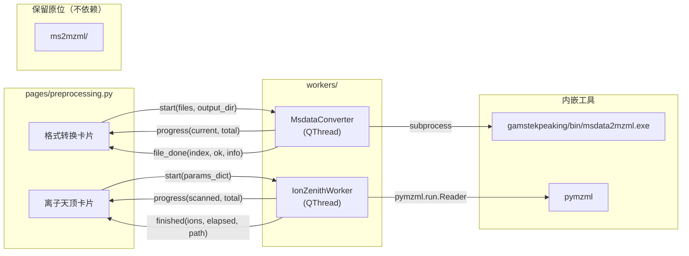

# GAMSTEKPEAKing — 前处理板块设计方案

> 状态：待评审  
> 日期：2026-07-27  
> 作者：AI 辅助设计  
> 框架：PySide6 + 纯代码 + QSS 深度美化

---

## 1. 项目定位

**GAMSTEKPEAKing** 是 QuanFormer 项目的下一代统一桌面应用，最终将整合全部功能模块（前处理、寻峰模型、定量分析等）。采用左侧边栏导航 + 卡片式内容区的现代化布局。

本 spec 聚焦**首批上线的「前处理」板块**，包含两个功能：格式转换（msdata→mzML）和离子天顶算法。

---

## 2. 目录结构

```
gamstekpeaking/
├── main.py              # 入口，启动 QApplication + 主窗口
├── app.py               # 主窗口类（侧边栏 + QStackedWidget 页面路由）
├── theme.py             # QSS 样式表 + 调色板/字体常量
├── pages/
│   ├── __init__.py
│   ├── preprocessing.py  # 前处理板块（首批上线）
│   ├── peak_finding.py   # 寻峰板块（占位，未来）
│   └── settings.py       # 设置板块（占位，未来）
├── workers/
│   ├── __init__.py
│   ├── converter.py      # msdata→mzML 后台 QThread（内嵌转换逻辑）
│   └── ion_zenith.py     # 离子天顶算法 后台 QThread
├── bin/                  # msdata2mzml.exe + OpenMS 运行时（从 ms2mzml/ 整合）
│   ├── msdata2mzml.exe
│   ├── *.dll
│   └── share/OpenMS/     # OpenMS 数据文件（CHEMISTRY, CV 等）
├── engine/               # 模型推理引擎（预留，未来从 model/quanformer/ 迁移）
│   ├── __init__.py
│   └── ...
├── assets/
│   └── logo.png
└── requirements.txt
```

### 依赖关系

| 模块 | 依赖 |
|------|------|
| `main.py` | `app.py` |
| `app.py` | `theme.py`, `pages/*`, `PySide6` |
| `pages/preprocessing.py` | `workers/converter.py`, `workers/ion_zenith.py`, `theme.py` |
| `workers/converter.py` | `subprocess`, `PySide6.QtCore`（转换逻辑内嵌，直接调用 `bin/msdata2mzml.exe`） |
| `workers/ion_zenith.py` | `pymzml`, `numpy`, `PySide6.QtCore` |
| `engine/` | 未来依赖 `model/quanformer/`，逐步迁移 |

### 与现有代码的关系

- **整合** `ms2mzml/bin/` 整个目录复制到 `gamstekpeaking/bin/`，转换逻辑直接写在 `workers/converter.py` 中，不 import `ms2mzml/`
- **封装** 根目录 `ion_zenith.py` 的算法核心到 `workers/ion_zenith.py`
- **不修改** 现有 `model/GUI/`，两套 GUI 独立共存
- **不修改** 现有 `model/quanformer/`，未来由 `engine/` 逐步迁移
- **`ms2mzml/` 保留原位**（历史兼容），GAMSTEKPEAKing 完全自包含

---

## 3. 编码规范

### 3.1 注释规范

`gamstekpeaking/` 内所有 `.py` 文件必须遵守以下注释要求：

| 位置 | 要求 |
|------|------|
| **文件头** | 模块级 docstring，说明文件用途、核心逻辑、依赖 |
| **每个函数/方法** | 完整的 docstring（功能、参数、返回值、异常） |
| **关键代码行** | 行内注释 `#` 解释非显而易见的逻辑 |
| **类定义** | 类级 docstring 说明职责和用法 |
| **Signal 定义** | 注释说明每个信号的参数含义 |

**示例格式**：

```python
"""
converter.py — msdata → mzML 格式转换后台线程
==============================================
封装 MsdataConverter(QThread)，异步调用 bin/msdata2mzml.exe
逐文件转换 .msdata 为 .mzML，发出 progress/file_done 信号驱动 UI 更新。

依赖: subprocess, pathlib, PySide6.QtCore
"""
```

### 3.2 README 规范

`gamstekpeaking/` 内**每个目录**都必须有一份 README，说明该目录的用途与结构：

| 位置 | 文件名 | 内容 |
|------|--------|------|
| 根目录 | `README.md` | 项目概述、快速开始、目录导航、依赖说明 |
| `pages/` | `README_pages.md` | 各页面模块的职责与路由映射 |
| `workers/` | `README_workers.md` | 各后台线程的职责与信号接口 |
| `engine/` | `README_engine.md` | 模型推理引擎的预留规划 |
| `bin/` | `README_bin.md` | msdata2mzml.exe 来源、依赖 DLL、使用说明 |
| `assets/` | `README_assets.md` | 静态资源清单 |

**README 内容要求**：
- 该目录的**一句话定位**
- 目录下**每个文件/子目录**的作用（列表形式）
- 如有对外接口（Signal、公共函数），列出签名

---

## 4. 导航与布局

### 4.1 整体布局

```
┌──────────────────────────────────────────────────────────┐
│  🏔 GAMSTEKPEAKing                          ─  ✕  ◻    │  ← 标题栏
├──────────┬───────────────────────────────────────────────┤
│          │                                               │
│  🏔️      │  ┌── 页面内容区（QStackedWidget）──┐         │
│  前处理   │  │                                  │         │
│  (激活)   │  │   功能卡片 1                     │         │
│          │  │   功能卡片 2                     │         │
│  📊      │  │   ...                            │         │
│  寻峰     │  │                                  │         │
│  (禁用)   │  └──────────────────────────────────┘         │
│          │                                               │
│  📈      │                                               │
│  定量     │                                               │
│  (禁用)   │                                               │
│          │                                               │
│  🔬      │                                               │
│  模型     │                                               │
│  (禁用)   │                                               │
│          │                                               │
│  ⚙️      │                                               │
│  设置     │                                               │
│  (禁用)   │                                               │
│          │                                               │
│  ─────── │                                               │
│  ⓘ 关于  │                                               │
│          │                                               │
├──────────┴───────────────────────────────────────────────┤
│  🟢 就绪                                    v1.0.0       │  ← 状态栏
└──────────────────────────────────────────────────────────┘
```

### 4.2 侧边栏规格

| 属性 | 值 |
|------|-----|
| 宽度 | 180px（固定，不可拖拽调整） |
| 背景 | `#1E293B` |
| 导航项高度 | 44px |
| 图标大小 | 20×20 px |
| 文字大小 | 13px, `#E2E8F0` |
| 激活态 | 左侧 3px `#38BDF8` 指示条 + 背景 `#273449` |
| 禁用态 | 文字 `#64748B`，不可点击 |
| 悬停态 | 背景 `#273449`（仅已启用的项） |

### 4.3 页面路由

使用 `QStackedWidget` + 侧边栏按钮映射：

| 侧边栏按钮 | 页面索引 | 对应文件 | 初始状态 |
|-----------|---------|---------|---------|
| 前处理 | 0 | `pages/preprocessing.py` | ✅ 激活 |
| 寻峰 | 1 | `pages/peak_finding.py` | 🔒 禁用 |
| 定量 | 2 | （待定） | 🔒 禁用 |
| 模型 | 3 | （待定） | 🔒 禁用 |
| 设置 | 4 | `pages/settings.py` | 🔒 禁用 |

---

## 5. 功能卡片 1：格式转换

### 5.1 UI 布局

```
┌─────────────────────────────────────────────────────────┐
│  📦 格式转换                        msdata → mzML       │
│  ─────────────────────────────────────────────────────  │
│                                                         │
│  ┌─────────────────────────────────────────────────┐   │
│  │        📂 拖拽 .msdata 文件到此处                │   │
│  │           或 点击选择文件                         │   │
│  └─────────────────────────────────────────────────┘   │
│                                                         │
│  已选文件 (N)                       输出: [默认目录 ▼]   │
│  ┌─────────────────────────────────────────────────┐   │
│  │  ✅ 20260522-01_1.msdata  →  3 .mzML, 12 MB    │   │
│  │  🔄 20260522-01_2.msdata  →  转换中... 45%      │   │
│  │  ⏳ 20260522-01_3.msdata                         │   │
│  │  ❌ 20260522-01_4.msdata  →  错误: 路径不存在    │   │
│  └─────────────────────────────────────────────────┘   │
│                                                         │
│  [████████████░░░░░░░░] 67%         [▶ 开始转换]        │
└─────────────────────────────────────────────────────────┘
```

### 5.2 交互逻辑

| 触发 | 行为 |
|------|------|
| 点击拖拽区 | 弹出 `QFileDialog.getOpenFileNames(filter="*.msdata")` |
| 拖拽文件到拖拽区 | 接受 `text/uri-list`，筛选 `*.msdata`，追加到列表 |
| 点击列表项 × | 从列表移除该文件 |
| 点击「开始转换」 | 禁用按钮、清空旧状态、逐文件启动后台转换 |
| 单个文件转换完成 | 更新对应行状态图标（✅/❌）+ 文件大小/错误信息 |
| 全部完成 | 恢复按钮、显示统计「成功 N/总数」 |
| 输出目录切换 | 下拉选择：`默认（同输入目录）` / `自定义...`（弹出目录选择器） |

### 5.3 后台线程 (`workers/converter.py`)

```python
class MsdataConverter(QThread):
    progress = Signal(int, int)        # (current_index, total)
    file_done = Signal(int, bool, str) # (index, success, info)

    def __init__(self, files, output_dir=None):
        # self.bin_dir = gamstekpeaking/bin/  (相对于本文件定位)
        # self.msdata2mzml_exe = bin_dir / "msdata2mzml.exe"
        # self.openms_share = bin_dir / "share" / "OpenMS"
        ...

    def run(self):
        # 内嵌转换逻辑（原 ms2mzml/ms2mzml.py 的 convert_file 逻辑）
        # 逐文件调用 subprocess.run([msdata2mzml_exe, input_file])
        # 环境变量 OPENMS_DATA_PATH 指向 bin/share/OpenMS
        # 自动检测输出目录下的 .mzML 文件确认转换成功
```

### 5.4 边界情况

| 场景 | 处理 |
|------|------|
| 选择非 `.msdata` 文件 | 文件对话框已过滤；拖拽时静默忽略 |
| 输出目录含空格/中文 | 正常处理（exe 在 `bin/` 下以相对路径运行） |
| `msdata2mzml.exe` 不存在 | 弹窗提示「未找到转换工具，请检查 bin/ 目录」 |
| 路径含中文导致 OpenMS 失败 | 检测失败信息，提示「路径含中文字符可能导致转换失败」 |

---

## 6. 功能卡片 2：离子天顶 (Ion Zenith)

### 6.1 UI 布局

```
┌─────────────────────────────────────────────────────────┐
│  ⚡ 离子天顶                    遍历 MS1 → 聚合 → CSV   │
│  ─────────────────────────────────────────────────────  │
│                                                         │
│  输入 mzML    [📂 选择文件]        20260423_001.mzML     │
│  输出 CSV     [📂 选择路径]        ion_zenith_output.csv │
│                                                         │
│  ▸ 高级参数                                  [展开 ▼]   │
│  ┌─ 展开后 ─────────────────────────────────────────┐  │
│  │  m/z 范围       [ 50.0   —   2000.0 ]  Da       │  │
│  │  容差 (ppm)      [ 10.0 ]           ppm          │  │
│  │  容差 (Da)       [ 0.01 ]           Da           │  │
│  │  强度下限        [ (无)  ]                        │  │
│  │  强度上限        [ (无)  ]                        │  │
│  │  最大谱图数      [ 0     ]  (0 = 扫描全部)        │  │
│  │  □ 重建 mzML 索引                                 │  │
│  └─────────────────────────────────────────────────┘  │
│                                                         │
│  [████████████████████] 100%  扫描 1,234 张 MS1 谱图    │
│  ✅ 完成：3,201 个离子 | 耗时 12.3s    [▶ 开始运行]     │
└─────────────────────────────────────────────────────────┘
```

### 6.2 交互逻辑

| 触发 | 行为 |
|------|------|
| 「选择文件」 | `QFileDialog.getOpenFileName(filter="*.mzML")` |
| 「选择路径」 | `QFileDialog.getSaveFileName(filter="*.csv")` |
| 「展开 ▼」 | 平滑展开高级参数面板（`QPropertyAnimation`），按钮变「收起 ▲」 |
| 「开始运行」 | 禁用所有控件，启动 `IonZenithWorker` 线程 |
| 运行中 | 进度条更新、实时显示已扫描谱图数 |
| 运行完成 | 显示离子数 + 耗时，输出路径变为可点击超链接 |
| 点击输出路径 | 在系统文件管理器中打开所在目录 |

### 6.3 参数校验

| 参数 | 校验规则 | 非法时行为 |
|------|---------|-----------|
| 输入 mzML | 文件必须存在 + 后缀 `.mzML` | 按钮禁用，placeholder 变红 |
| 输出 CSV | 目录必须存在 | 按钮禁用 |
| m/z 范围 | Min < Max，均 ≥ 0 | 输入框红框 + tooltip 提示 |
| 容差 | ≥ 0 | 输入框红框 |
| 最大谱图数 | ≥ 0 整数 | 自动修正为 0 |

### 6.4 后台线程 (`workers/ion_zenith.py`)

```python
class IonZenithWorker(QThread):
    progress = Signal(int, int)       # (scanned_spectra, total_or_zero)
    stats = Signal(int, int)          # (ms1_count, total_peaks)
    finished = Signal(int, float, str)  # (ion_count, elapsed_sec, output_path)
    error = Signal(str)

    def __init__(self, params: dict):
        # params = {input_mzml, output_csv, mz_min, mz_max, ...}
        ...

    def run(self):
        # 封装 ion_zenith.py 的核心算法：
        # 遍历 MS1 → m/z 容差分箱 → 保留最高强度 → 输出 CSV
```

---

## 7. 视觉风格

### 7.1 配色方案（深色科技风）

| 令牌 | 色值 | 用途 |
|------|------|------|
| `bg_primary` | `#0F172A` | 主窗口背景 |
| `bg_sidebar` | `#1E293B` | 侧边栏背景 |
| `bg_card` | `#1E293B` | 卡片背景 |
| `bg_card_hover` | `#273449` | 卡片悬停 |
| `bg_input` | `#0F172A` | 输入框背景 |
| `text_primary` | `#E2E8F0` | 主文字 |
| `text_secondary` | `#94A3B8` | 次要文字/占位符 |
| `text_disabled` | `#64748B` | 禁用文字 |
| `accent` | `#38BDF8` | 强调色（按钮、焦点、指示条） |
| `accent_hover` | `#7DD3FC` | 强调色悬停 |
| `success` | `#34D399` | 成功/完成 |
| `warning` | `#FBBF24` | 警告/进行中 |
| `error` | `#F87171` | 错误/失败 |
| `border` | `#334155` | 卡片/输入框边框 |
| `border_focus` | `#38BDF8` | 聚焦边框 |
| `progress_bg` | `#1E293B` | 进度条背景 |
| `progress_fill` | `#38BDF8` | 进度条填充 |

### 7.2 排版

| 属性 | 值 |
|------|-----|
| 主字体 | `"Microsoft YaHei", "Segoe UI", sans-serif` |
| 等宽字体 | `"Cascadia Code", "Consolas", monospace` |
| 标题 | 16px, bold, `text_primary` |
| 卡片标题 | 14px, bold, `text_primary` |
| 正文 | 13px, `text_primary` |
| 小字/状态 | 11px, `text_secondary` |
| 输入框文字 | 13px, `text_primary` |

### 7.3 组件样式要点

| 组件 | 规格 |
|------|------|
| **卡片** (`QFrame`) | `border-radius: 8px; border: 1px solid #334155; padding: 16px; margin-bottom: 12px;` |
| **主按钮** | `background: qlineargradient(x1:0,y1:0,x2:1,y2:0, stop:0 #38BDF8, stop:1 #818CF8); border-radius: 6px; padding: 8px 20px; color: #0F172A; font-weight: bold;` |
| **次按钮** | `border: 1px solid #475569; border-radius: 6px; padding: 8px 20px; color: #E2E8F0;` |
| **输入框** | `background: #0F172A; border: 1px solid #334155; border-radius: 6px; padding: 6px 10px; color: #E2E8F0;` |
| **拖拽区** | `border: 2px dashed #475569; border-radius: 8px;` 拖入时 `border-color: #38BDF8; background: rgba(56,189,248,0.05);` |
| **进度条** | 4px 高度，蓝紫渐变填充，圆角，`QProgressBar::chunk` 条纹动画 |

### 7.4 动画

| 动画 | 实现 |
|------|------|
| 侧边栏页面切换 | 内容区淡入淡出，`QPropertyAnimation(opacity)` |
| 高级参数展开/收起 | `QPropertyAnimation(maximumHeight)`，300ms ease |
| 按钮悬停 | QSS `:hover` 伪类，0.15s 过渡 |
| 输入框聚焦 | QSS `:focus` 伪类，边框颜色过渡 |
| 进度条 | QSS 条纹 + `background-position` 动画 |

---

## 8. 数据流



---

## 9. 错误处理策略

| 层级 | 策略 |
|------|------|
| **输入校验** | 前端即时校验（文件存在性、参数合法性），不合格则禁用运行按钮 |
| **运行时错误** | QThread 捕获异常 → `error` signal → UI 显示错误卡片（红色边框 + 消息） |
| **转换失败** | 单文件失败不中断整体，标记 ❌ + hover 显示原因 |
| **崩溃保护** | `main.py` 最外层 try/except + 日志写入 `gamstekpeaking/error.log` |
| **路径问题** | 所有路径使用 `os.path.normpath()` / `Path.resolve()`，检测中文路径时给出提示 |

---

## 10. 测试要点

| 测试项 | 方法 |
|--------|------|
| 拖拽文件到格式转换卡片 | 手动测试 + 验证文件列表更新 |
| 批量 msdata 转换 | 用 `data/JiangNanU_Sample/` 下的 msdata 文件 |
| 单文件 mzML 离子天顶 | 用 `data/test2/mzML/20260423_001.mzML` |
| 高级参数展开/收起动画 | 目视验证 300ms 平滑过渡 |
| 中文路径处理 | 在含中文路径下运行格式转换 |
| 参数校验（非法输入） | 输入负 m/z、倒置范围等 |
| 运行中关闭窗口 | QThread.quit() + wait() 优雅退出 |

---

## 11. 未来扩展点

| 板块 | 预期功能 |
|------|---------|
| 寻峰 | 整合 DETR 模型预测、EIC 可视化、峰面积定量 |
| 定量 | 整合 `utils/quantify.py`，批量定量分析 |
| 模型 | 模型管理（下载/切换/评估），从 `engine/` 加载 |
| 设置 | 全局偏好（主题、语言、默认路径、GPU 选择） |

---

## 12. 自审清单

- [x] 无 TBD/TODO 占位符
- [x] 架构图与功能描述一致
- [x] 范围聚焦于首批前处理板块（未扩散到寻峰/定量实现细节）
- [x] 所有参数校验规则明确
- [x] 错误处理层级清晰
- [x] 与现有代码（model/GUI/、ms2mzml/）的边界清晰
- [x] 编码注释规范明确（文件头/函数/关键行/Signal 均需注释）
- [x] README 规范明确（每个目录一份，根目录 README.md，子目录 README_<name>.md）
