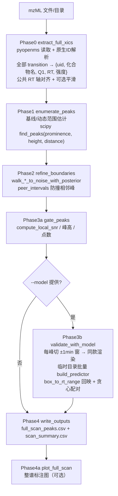

# 整谱 XIC 全峰识别推理模式 — 设计方案

> 状态：待评审
> 日期：2026-08-26
> 作者：AI 辅助设计（经 3 轮审阅收敛）

---

## 1. 背景与动机

现有推理管线（`inference.cli` 的 `roi / batch_dir / pipeline` 三种模式）是**标注驱动的 ±1min 小窗口范式**：

1. 读取 mzML → 仅标注命中通道生成 ROI（窗口中心 = 标注 ert，±1min 裁剪）
2. 400x300 ROI 图送模型，在窗口内检测峰
3. 像素框 → `box_to_rt_range` 映射回 RT 区间

其局限：**峰识别范围被限定在 ROI 窗口内**，无法回答"整条 XIC 上到底有哪些峰"。本设计新增第四种推理模式 `fullscan`：读取 mzML，对**全部 transition 的完整 XIC**（整张色谱图，全 RT 范围）枚举并识别**所有峰**。

### 决策记录（前三轮审阅）

| 轮次 | 决策点 | 结论 |
|---|---|---|
| R1 | 峰识别引擎 | **混合方案**：信号处理枚举候选 + 复用现有边界精修 + 模型滑窗验证 |
| R1 | 模型验证角色 | **验证 + 输出分数** |
| R1 | 输出产物 | 峰列表 CSV + 整谱标注图 |
| R1 | 通道范围 | **全部 transition**（TIC 类无数值通道剔除，不依赖标注） |
| R2 | 未验证峰处置 | **所有峰都保留**，模型分保留原始值（不因低于阈值而置 0/丢弃） |
| R2 | 最终边界来源 | **模型框优先**：score≥阈值 → 模型框 RT；否则信号外推结果 |
| R2 | 推进方式 | 先写设计文档，评审通过后再实现 |

### 可行性结论

**可行**，技术栈已齐备：
- mzML 读取 + 编码修复：`utils/mzml_load.py`
- XIC 对齐/平滑、噪声/基线估计：`utils/xic_peak_utils.py`、`preprocessing/xic_extraction.py`
- 边界外推精修（含 peer 防撞后验）：`inference/two_round_detection.py` 的 `walk_interval_*_to_noise_with_posterior` / `adjust_first_round_interval`
- scipy 峰检测（prominence）：`postprocessing/valley_split.py` 已在用
- 模型批量推理：`utils/predict_utils.py` 的 `build_predictor`
- 像素→RT 映射：`utils/roi_rt_mapping.py` 的 `box_to_rt_range`

**核心约束**：模型训练分布是 400x300 像素、±1min 窗口、强度自动缩放。整条 XIC 可达 10~30+ 分钟，**整谱直接缩放喂模型会破坏峰形比例、偏离训练分布**，故必须"按峰切窗"验证，而不是整谱送模型。

---

## 2. 与现有推理管线的差异

| 维度 | 现有 pipeline | 新模式 fullscan |
|---|---|---|
| 通道范围 | 仅标注命中 | 全部有母离子 m/z（Q1）的 transition |
| RT 范围 | ±1min ROI 窗口 | 完整 RT 轴 |
| 峰来源 | 模型在窗口内检测 | 信号处理枚举候选（模型可选验证） |
| 标签依赖 | 必填 --labels | 不依赖 |
| 峰数上限 | 每图 1~2 框 | 每通道 0..N 峰 |
| 输出 | prediction.csv / prediction_refined.csv | full_scan_peaks.csv |

---

## 3. 新增/修改文件

```
model/
├── inference/
│   ├── fullscan.py            # 【新增】整谱全峰识别主模块（Phase 0-4）
│   └── cli.py                 # 【修改】新增 --mode fullscan 分支
├── preprocessing/
│   └── xic_extraction.py      # 【修改】抽取渲染函数 render_roi_jpeg（供两处复用）
├── utils/
│   └── xic_peak_utils.py      # 【修改】新增 compute_local_snr
└── configs/
    └── full_xic_scan.json     # 【新增】fullscan 默认参数
```

### 模块结构（`inference/fullscan.py`，预计 450~550 行）

```
fullscan.py
├── extract_full_xics(mzml_path, ...)   # Phase0：全谱 XIC 组装
├── enumerate_peaks(rt, intensity)      # Phase1：候选枚举（find_peaks + prominence）
├── refine_boundaries(peaks, ...)       # Phase2：复用 walk_*_to_noise_with_posterior
├── gate_peaks(peaks, ...)              # Phase3a：SNR/峰高/点数门控
├── validate_with_model(...)            # Phase3b：切窗 → 批量推理 → 框映射
├── plot_full_scan(...)                 # Phase4a：整谱标注图
└── write_outputs(...)                  # Phase4b：CSV + 汇总
```

---

## 4. 数据流



---

## 5. 详细算法设计

### Phase 0 — 全谱 XIC 组装

**输入数据模型（严格限定）**：本模式只读取 mzML 色谱（chromatogram）时序数据，逐通道提取以下字段：

```
{ uid(native_id), 化合物名称, 母离子 m/z(Q1), 强度数组(可选高斯平滑), RT 数组(分钟) }
```

不读取：q3/子离子 m/z、MS1/MS2 谱图扫描、其他元数据。

- 复用 `mzml_load.load_ms_experiment` + `mzml_chromatogram_ids.resolve_native_ids_for_chromatograms`
- 逐 chromatogram：
  - uid = native_id（中文编码兼容沿用现有解析）
  - 化合物名称 = native_id 或色谱元数据中的化合物名（沿用现有回退规则）
  - 母离子 m/z（Q1）= 色谱 precursor 元数据，或 native_id 文本解析（如 `Q1=...`）；**不解析 Q3**
  - RT 数组：秒→分钟（单位判定优先用**中位时间步长**：步长落在秒制区间判秒，否则回退 >200 启发式；D15）
  - 强度数组
- 剔除：空色谱、无数值母离子 m/z（Q1）的通道（TIC 类，reason=tic_excluded）
- 去重：仅当 **(Q1, uid, RT 轴完全一致)** 才判为真重复并跳过；RT 轴不同则都保留（D14，避免定量/定性离子裸名通道被误去重）
- 高斯平滑（可选，参数控制）：`smooth_sigma > 0` 时执行 `gaussian_filter1d(sigma=smooth_sigma)`（默认 0.8）；`smooth_sigma = 0` 时**不进行平滑**，强度数组保持 mzML 原始值，且通道级 QC（点数/最大强度）基于原始强度判定
- 公共 RT 轴：首条有效色谱的 RT 轴为准，其余 `interp1d` 对齐（复用现有逻辑）

### Phase 1 — 候选枚举（信号处理）

对每条 transition 的强度序列（**统一使用 Phase 0 确定的同一条数组**——`smooth_sigma>0` 用平滑后，否则原始）：

```
# 前置：排除溶剂前沿/柱平衡区（RT < void_time_min，默认 0.5 min），避免进样尖峰污染 dynamic
body_mask = rt >= void_time_min
baseline  = percentile(intensity[body_mask], baseline_percentile)   # 默认 25
dynamic   = max(intensity[body_mask]) - baseline

find_peaks(intensity[body_mask],
    height     = baseline + min_peak_ratio * dynamic,               # 默认 0.04
    prominence = max(prominence_ratio * dynamic,                    # 默认 0.055 × dynamic
                     min_prominence_abs),                           # 绝对下限，防 D2 吞小峰
    distance   = max(min_peak_gap_points,                           # 默认 3 点
                     min_peak_width_min / median_rt_step))          # RT 尺度，防 D3 采样密度不稳
```

- 双门槛 prominence：相对全局 + 绝对下限，MRM 共流出物强度差几个量级时小峰仍可检出
- plateau 峰：取平台中点作 apex
- 相邻候选若谷不显著（复用 `valley_split._pair_passes_double_peak_gate`，全谱场景用更严格参数）→ 合并；**顺序固定：先合并、再精修、精修后区间仍重叠才最终合并**（D6）
- 通道级上限 `max_peaks_per_channel`（默认 50）：超限告警并保留 prominence 前 50（防 D11）

### Phase 2 — 边界精修（完全复用现有工具）

- 每峰初始框：apex ± `init_half_width_min`（默认 0.05 min，或 ≥3 个采样点）
- **apex 重锚**：以枚举 apex 为中心在初始框内重新取 argmax 作锚点（`adjust_first_round_interval` 内置，避免枚举尖刺偏离真峰顶，D8）
- 阈值：`roi_full_low_decile_mean_intensity`（全通道低 10% 强度均值，`edge_noise_stop_mode="roi_bottom_decile_mean"` 语义）
- 调 `adjust_first_round_interval`，关键传参：
  - `peer_rt_intervals` = 该通道其余候选峰区间 → 后验防撞（`boundary_peer_thr_scale=2.0`）
  - `boundary_posterior_lookahead=5`、`boundary_posterior_mean_scale=1.25`
  - `pred_width_anchor` 不传（不做宽度上限约束，整谱峰宽允许超过 ROI 约束）
- **两遍精修（D13）**：首遍全部候选粗走（无 peer）→ 以首遍精修结果为 peer 区间走第二遍，消除"精修前宽区间互相截停"的循环依赖

### Phase 3a — 门控

- **本地 SNR**（新增 `compute_local_snr`，见 §6）：噪声窗取"本峰精修边界到最近相邻峰边界之间"的安静区段（任一侧点数不足则回退全通道低分位窗），SNR = 2·(apex−baseline)/noise_pp
- 门控（默认值，均可配）：
  - `min_snr` = 3.0
  - 峰跨距 ≥ `min_peak_span_points` = 5（baseline 以上连续点数）
  - `min_area` = 0（关闭）
- **注意**：Phase3a 只做质量列统计与弱过滤；用户 R2 决策"所有峰都保留"仅针对模型验证环节，信号级弱峰仍按上述门控过滤（这是"峰"的定义，不是模型验证丢弃）

### Phase 3b — 模型验证（--model 提供时）

1. 每候选峰以 apex 为中心切窗：`rt_window_bounds_minutes(apex, rt_axis)` → (rt_lo, rt_hi)
2. 全部窗口一次性渲染到临时目录（`render_roi_jpeg`，与训练图像素级同款）
3. `build_predictor(model, tmp_dir, threshold, plot=False)` 单轮批量推理
4. 每结果逐框 `box_to_rt_range(x1,y1,x2,y2, apex, rt_axis, rt_window=(rt_lo,rt_hi))`
5. 候选峰 ↔ 模型框**贪心配对**（一个框至多验证一个峰），配对须满足：**候选 apex 必须落在模型框 RT 范围内**（D9），中心距离仅作 tie-break；不满足则视为未配对
6. 结果列：
   - `model_score` = 配对框原始分数（**低于阈值也保留原始值**；未配对为 NaN）
   - `validated` = model_score ≥ threshold
   - **边界**：validated → 模型框 RT（模型框优先）；否则 Phase2 信号外推边界
7. **所有候选峰一律保留**（不因未验证丢弃）
8. **已知局限（D10）**：小峰紧邻更高峰时，±1min 窗口内目标峰被压缩贴近底部，模型可能低分/漏检——此为训练分布固有偏移，记录 `boundary_source=signal` 供复核，不视为算法错误

### Phase 4 — 输出

- `full_scan_peaks.csv`：逐峰一行（列定义见 §7）
- `scan_summary.csv`：每 transition 一行（通道、峰数、RT 范围、最大强度）
- `scan_plots/`：每 transition 一张整谱标注图（蓝线 XIC、每峰 axvspan + 峰号 + 分数、validated 红/未验证灰）
- 临时窗口目录默认清理；`--keep_windows` 保留供复核

---

## 6. 新增小函数

### 6.1 `compute_local_snr`（utils/xic_peak_utils.py）

```python
def compute_local_snr(rt_array, intensity_row, rt_min, rt_max,
                      neighbor_intervals=None, min_noise_pts=3,
                      baseline_percentile=25.0) -> float:
    """
    本地 SNR：噪声窗取 [本峰边界, 最近相邻峰边界] 之间的安静区段；
    任一侧点数不足时回退全通道低分位窗。
    SNR = 2 * (apex - baseline) / max(noise_pp_left, noise_pp_right)
    """
```

与现有 `compute_snr_outside_box` 的区别：后者取固定 20%·框内点数的两侧窗，整谱场景下易把相邻峰计入噪声 → 低估 SNR。新函数以相邻峰为界，只统计真正安静区段。

### 6.2 `render_roi_jpeg`（preprocessing/xic_extraction.py）

把 `extract_xic_with_pyopenms` 内联的 ROI 绘图（[xic_extraction.py L491-507](file:///d:/yinlibo/MRMPFormer/model/preprocessing/xic_extraction.py#L491-L507)）抽取为模块级函数：

```python
def render_roi_jpeg(rt_win, int_win, rt_lo, rt_hi, out_path):
    """400x300 无坐标轴蓝线图；set_xlim(rt_lo, rt_hi)。与训练图一致。"""
```

- `extract_xic_with_pyopenms` 改调用此函数（行为不变）
- `fullscan` 验证窗口复用此函数（保证分布一致 + 像素→RT 映射严格成立）

---

## 7. 输出格式

### full_scan_peaks.csv

| 列 | 类型 | 说明 |
|---|---|---|
| mzml_stem | str | mzML 文件名（去扩展名） |
| chrom_index | int | 通道序号（0-based） |
| uid | str | native_id（通道唯一标识） |
| compound_name | str | 化合物名称 |
| q1 | float | 母离子 m/z（无则 NaN） |
| peak_no | int | 通道内 1-based 峰号 |
| rt_min / rt_peak / rt_max | float | 分钟 |
| apex_intensity | float | 峰顶强度 |
| area | float | 梯形积分 × AREA_TIME_UNIT_SCALE（与 predictor 同量纲） |
| snr | float | 本地 SNR（Phase3a） |
| n_points | int | 峰跨距点数 |
| validated | bool | model_score ≥ threshold（无模型时全 False） |
| model_score | float | 配对框原始分（可 < threshold；未配对 NaN） |
| boundary_source | str | "model" / "signal" |

### scan_summary.csv

| 列 | 说明 |
|---|---|
| chrom_index / uid / compound_name / q1 | 通道标识 |
| n_peaks | 检出峰数 |
| rt_range_min / rt_range_max | 通道 RT 覆盖（min） |
| max_intensity | 通道最大强度 |

---

## 8. 参数表（CLI 覆盖 config，config 覆盖默认）

| 参数 | 默认 | 说明 |
|---|---|---|
| mode | fullscan | 固定 |
| mzml / batch_dir | — | 单文件或目录递归（复用 `_collect_mzml_inputs`） |
| model | None | 提供则开启模型验证 |
| threshold | 0.99 | 模型置信度阈值（validated 判定） |
| smooth_sigma | 0.8 | 扫描级高斯平滑 sigma；**0 = 关闭平滑**（强度保持原始值） |
| output_dir | ../output/inference/full_scan | 输出根目录 |
| min_max_intensity | 1000.0 | 通道级最低峰值强度 QC |
| min_chrom_points | 10 | 通道级最少点数 QC |
| baseline_percentile | 25.0 | 基线分位（global_percentile 模式） |
| baseline_mode | global_percentile | 基线模式：global_percentile / local_valley（取峰两侧谷点中位，抗 D1 全局基线失真） |
| min_peak_ratio | 0.04 | 峰高 = baseline + r·dynamic |
| prominence_ratio | 0.055 | find_peaks prominence（相对 dynamic） |
| min_prominence_abs | 0.0 | prominence 绝对下限（防 D2 小峰被全局 dynamic 吞；>0 时启用） |
| min_peak_gap_points | 3 | find_peaks 最小点距 |
| min_peak_width_min | 0.10 | RT 尺度最小峰宽（distance 按 通道中位步长换算，防 D3） |
| void_time_min | 0.5 | 排除溶剂前沿/柱平衡区（RT < 此值不参与 dynamic 估计与枚举） |
| max_peaks_per_channel | 50 | 单通道候选上限，超限告警保留 prominence 前 N（防 D11） |
| init_half_width_min | 0.05 | 精修初始半宽 |
| boundary_posterior_lookahead | 5 | 边界后验窗点数 |
| boundary_posterior_mean_scale | 1.25 | 后验均值倍数 |
| min_snr | 3.0 | 峰级 SNR 门 |
| min_peak_span_points | 5 | 峰跨距门 |
| min_area | 0.0 | 面积门（0=关） |
| window_half_min | 1.0 | 验证窗口半宽（与训练一致） |
| keep_windows | False | 保留验证窗口图 |
| no_plots | False | 关闭整谱标注图 |

---

## 9. CLI 集成

`inference/cli.py` 新增分支：

```
# 整谱全峰识别（单文件或目录递归；不依赖 --labels）
python -m inference.cli --mode fullscan --mzml ../data/test/mzml/sample.mzML \
    --model checkpoint/quanformer.pth
python -m inference.cli --mode fullscan --batch_dir ../data/test/mzml \
    --model checkpoint/quanformer.pth --output_dir ../output/test/fullscan_01

# 纯信号处理（不跑模型）
python -m inference.cli --mode fullscan --batch_dir ../data/test/mzml --no_model
```

- `_collect_mzml_inputs` 复用（同名 mzML 自动加路径前缀）
- 不校验 `--labels`（新模式不依赖标注）
- 每个样品输出 `<output_dir>/<sample_stem>/`；`--config` 参数外置机制与现有模式一致

---

## 10. 配置 JSON（model/configs/full_xic_scan.json）

```json
{
  "_comment_mode": "整谱 XIC 全峰识别推理模式",
  "mode": "fullscan",
  "model": "checkpoint/quanformer.pth",
  "threshold": 0.99,
  "smooth_sigma": 0.8,
  "output_dir": "../output/inference/full_scan",
  "mzml": null,
  "batch_dir": null,
  "min_max_intensity": 1000.0,
  "min_chrom_points": 10,
  "baseline_percentile": 25.0,
  "min_peak_ratio": 0.04,
  "prominence_ratio": 0.055,
  "min_peak_gap_points": 3,
  "init_half_width_min": 0.05,
  "boundary_posterior_lookahead": 5,
  "boundary_posterior_mean_scale": 1.25,
  "min_snr": 3.0,
  "min_peak_span_points": 5,
  "min_area": 0.0,
  "window_half_min": 1.0,
  "keep_windows": false,
  "no_plots": false
}
```

---

## 11. 错误处理

| 场景 | 处理 |
|---|---|
| mzML 无色谱 / 加载失败 | 复用 `load_ms_experiment` 的四级兜底（长路径/短路径/临时副本/UTF-8 修复）；仍失败则报错跳过该文件 |
| 通道 RT 轴单位不确定 | 沿用 >200 秒制启发式，并在 summary 标注假设单位 |
| 单通道异常（全零/点数过少） | 记 summary，不中断整文件 |
| 模型加载失败 | 报错并回退纯信号模式（warning 提示） |
| 峰值异常多（>500/通道） | 打印 warning（疑似噪声门槛过低），仍正常输出 |
| 输出目录冲突 | 沿用现有"同名 mzML 加路径前缀"策略 |

---

## 12. 性能分析

- **纯信号处理**：每通道 find_peaks + 边界 walk 均为 O(n)，300 通道 × 2000 点 → 秒级
- **模型验证**：成本 = 候选峰总数 × 单图推理。常规 300 通道 × 5 峰 = 1500 次，单图 ~50-100ms → 1-3 分钟；**候选数受 `max_peaks_per_channel` 约束**，最坏上限 300×50=15000 次推理；全部窗口一次性渲染后单轮 `build_predictor` 批量推理，无逐图启动开销
- 内存：窗口图逐批写入临时目录，不常驻

---

## 13. 测试要点

| 测试项 | 方法 |
|---|---|
| 单 mzML 冒烟 | 用现有 `data/` 下任一 mzML 跑 `--mode fullscan --no_model`，检查 CSV 行数与标注图 |
| 模型验证 | 同文件加 `--model`，抽查每峰 validated/model_score/boundary_source 三列 |
| 边界防撞 | 构造双峰/共流出峰通道，验证相邻峰区间不互相吃掉 |
| 与训练分布一致性 | 验证窗口图与 ROI 图逐像素比对渲染样式（尺寸/坐标轴/线条） |
| 同窗多峰 | 构造 2min 内 2-3 峰的通道，验证贪心配对结果 |
| 批量目录 | 含子目录递归 + 同名 mzML，验证输出目录不覆盖 |
| 弱峰/噪声 | 调整 prominence_ratio / min_snr，验证峰数单调变化 |
| [D2] 小峰漏检 | 构造 1e6 强峰 + 5e3 弱峰同通道，开启 `min_prominence_abs` 后弱峰仍检出 |
| [D3] 采样密度 | 同一 XIC 重采样为 0.05 / 0.5 min 步长，峰检出结果一致 |
| [D5] 前沿峰污染 | 构造 t≈0 进样尖峰，dynamic 不受污染、真实峰可检出 |
| [D14] 误去重 | 同 Q1、同裸名、不同 RT 轴的色谱，两条均保留 |

---

## 14. 未来扩展点

- 峰列表 → 面积定量直接复用 `utils/quantify.py` 的积分逻辑
- `validated` 分数聚合 → 每 transition 的"最可信峰"自动标注（接现有 RT 门控/QC 体系）
- 滑窗全谱模型推理（纯模型方案）作为可切换后端
- 与现有 pipeline 的 `prediction_refined.csv` 并表对比（联合评审）

---

## 15. 实现任务清单

| # | 任务 | 落点 |
|---|---|---|
| 1 | 抽取 `render_roi_jpeg` 并让 `extract_xic_with_pyopenms` 复用 | preprocessing/xic_extraction.py |
| 2 | 新增 `compute_local_snr` | utils/xic_peak_utils.py |
| 3 | 实现 `inference/fullscan.py`（Phase 0-4） | 新增 |
| 4 | CLI 接入 `--mode fullscan` | inference/cli.py |
| 5 | 新增 `model/configs/full_xic_scan.json` | 新增 |
| 6 | 单 mzML 原型验证 + 冒烟测试 | 手动验证 |

---

## 16. 两轮自我对抗审阅记录（D1-D15）

对候选枚举算法及与 Phase 2/3 的衔接做了两轮攻击性审阅，缺陷与对策均已折叠进 §5/§8/§12：

| 轮次 | # | 缺陷 | 对策落点 |
|---|---|---|---|
| 参数层 | D1 | 全局单一基线失真，两阶段基线概念并存 | `baseline_mode` 增加 local_valley（§8） |
| 参数层 | D2 | prominence 相对全局 dynamic 吞真实小峰 | `min_prominence_abs` 双门槛（§5 P1/§8） |
| 参数层 | D3 | distance 按点数随采样密度不稳 | `min_peak_width_min` 按通道中位步长换算（§5 P1/§8） |
| 参数层 | D4 | 各阶段平滑/原始数组不一致 | 明确全流程统一用同一条数组（§5 P1） |
| 参数层 | D5 | 溶剂前沿大峰污染 dynamic | `void_time_min` 排除前置区（§5 P1/§8） |
| 参数层 | D6 | 合并参数来自 ROI 小窗场景 | 合并顺序固定：先合并→精修→重叠才终并（§5 P1） |
| 参数层 | D7 | 通道级 QC 一刀切 | 降级 warning + summary 记录（§11） |
| 结构层 | D8 | 枚举 apex 与大峰坡上尖刺偏差 | apex 重锚（§5 P2） |
| 结构层 | D9 | 模型配对仅中心距离、宽框误配 | 配对须 apex 落在框内（§5 P3b） |
| 结构层 | D10 | 小峰邻大峰窗口渲染压缩（分布偏移） | 记为已知局限，输出 signal 边界供复核（§5 P3b） |
| 结构层 | D11 | 峰数爆炸无上限 | `max_peaks_per_channel=50`（§5 P1/§8/§12） |
| 结构层 | D12 | 整谱标注图可读性差 | 图宽按 RT 跨度缩放（§5 P4） |
| 结构层 | D13 | peer 精修前宽区间循环依赖 | 两遍精修（§5 P2） |
| 结构层 | D14 | (Q1,uid) 去重依赖 native_id 区分度 | 仅 (Q1,uid,RT轴一致) 判真重复（§5 P0） |
| 结构层 | D15 | RT 秒/分 >200 启发式误判 | 中位时间步长优先判定（§5 P0） |

**4 个硬伤级缺陷（修复后为必测项）**：D2 小峰漏检、D3 采样密度不稳、D5 前沿峰污染、D14 误去重——已列入 §13 测试要点。

---

## 17. 自审清单

- [x] 无 TBD/TODO 占位符
- [x] 输入严格限定为 mzML 色谱时序字段：uid(native_id)/化合物名称/母离子 m/z(Q1)/高斯平滑/RT 数组/强度数组；不含 q3、子离子与 MS1/MS2 谱图数据
- [x] 与现有代码复用边界清晰（渲染/SNR/边界/映射均复用，不改训练路径）
- [x] 模型输入分布一致性有保障（渲染同款 + 按峰切窗）
- [x] R1-R2 六项决策全部落进规格（混合/验证输出分/CSV+图/全部通道/保留全部峰/模型框优先）
- [x] 参数表完整、默认值明确、config 可覆盖
- [x] 错误处理与性能分析覆盖主要风险
- [x] 输出格式列定义完整（CSV 两表 + 标注图）
