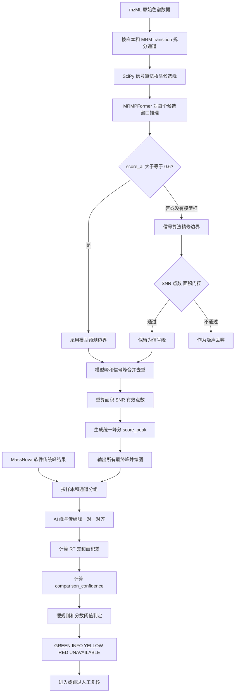

# MRMPFormer + MassNova 信号算法：当前预警整体流程详解

## 1. 文档目的

本文描述当前代码中已经实现的预警流程，包括：

1. AI 端如何生成模型峰和信号峰。
2. 每个峰如何获得自身分数。
3. AI 峰如何与 MassNova 软件传统算法峰对齐。
4. RT 差、面积差和复合置信度如何计算。
5. 绿、黄、红、信息和不可用状态如何判定。
6. 峰级预警如何汇总为样本级预警。
7. 当前实现与最终软件部署之间还存在的边界。

对应代码：

- 推理主流程：`inference/massnova.py`
- 峰自身分：`utils/peak_scores.py`
- 峰对齐与置信度：`postprocessing/comparison_confidence_v2.py`
- 推理参数：`configs/massnova.json`
- 置信度参数：`configs/comparison_confidence_v2.json`

当前没有修改 `D:\yinlibo\MRMPFormer\cpp` 中的软件接口。

## 2. 流程总览



整体原则是：先判断 AI 最终发现了哪些峰，再判断 AI 峰和传统算法峰是否属于同一峰事件，最后计算两套结果的一致性和风险。

## 3. AI 端最终峰的产生

### 3.1 按 MRM transition 独立处理

一个 mzML 文件表示一个样本。文件中的各个 MRM transition 作为独立色谱通道处理。每个通道有自己的：

- `chrom_index`
- `uid`
- Q1
- RT 数组
- intensity 数组

不同样本或不同 transition 的峰不会混在一起检测和对齐。

### 3.2 信号算法枚举候选峰

当前生产路径首先使用 SciPy `find_peaks` 和 prominence 等信号条件枚举候选峰顶。这里得到的是候选 apex，并不是最终峰。

候选峰还需要进入 MRMPFormer 或信号兜底路径。明显不满足最终信号门控的候选会作为噪声删除。

### 3.3 MRMPFormer 模型路径

围绕每个候选 apex 截取约 ±1 min 的窗口，并送入 MRMPFormer。模型输出检测框和原始分数 `score_ai`。

当前暂定阈值：

```text
score_ai >= 0.6
```

达到阈值，并且预测框包含候选 apex 时：

```text
boundary_source = model
score_source = model
score_peak = score_ai
```

模型预测的左右边界直接作为该峰的最终边界。`score_ai` 是模型原始检测分数，目前没有经过概率校准，所以不能解释为严格的“正确率百分比”。

### 3.4 信号算法兜底路径

如果候选峰没有获得达到阈值的有效模型框，会进入信号算法兜底：

1. 信号边界精修。
2. 计算局部 SNR。
3. 计算有效峰点数。
4. 计算峰面积。
5. 执行 SNR、点数和面积门控。

通过门控后：

```text
boundary_source = signal
score_source = signal_rule
score_peak = score_signal
```

“所有峰都参与置信度”指最终通过模型或信号路径，并完成去重的峰。信号门控前的原始噪声候选不属于最终预测峰。

## 4. 信号峰自身分数

信号峰没有 MRMPFormer 的 `score_ai`，因此使用 SNR 和有效峰点数生成透明的规则分：

```text
conf_signal_snr = SNR / (SNR + 10)

conf_signal_points = clip(n_points / 10, 0, 1)

score_signal
= conf_signal_snr^0.8
× conf_signal_points^0.2
```

设计含义：

- SNR 是主要证据，权重为 0.8。
- 有效点数是辅助证据，权重为 0.2。
- SNR 使用饱和函数，避免超高 SNR 无限放大分数。
- 几何平均会让任何一个特别差的分量拉低总分。
- 该分数不使用传统算法 RT 或传统算法面积。
- `score_signal` 是工程规则分，不是模型概率。

默认参数示例：

| SNR | 有效点数 | `score_signal` |
|---:|---:|---:|
| 10 | 5 | 0.5000 |
| 10 | 10 | 0.5743 |
| 20 | 10 | 0.7230 |
| 40 | 10 | 0.8365 |

CSV 会同时保存：

- `signal_score`
- `signal_score_snr_component`
- `signal_score_points_component`
- `peak_score`
- `score_source`

这样后续修改信号评分公式时，可以根据原始分量重新计算和审计。

## 5. 模型峰和信号峰的去重

模型峰和信号峰合并后，满足下面两个条件时视为同一峰的重复检测：

```text
峰区间存在重叠
并且
两个 apex 的 RT 差 <= 0.2 min
```

重复峰保留顺序：

1. 模型边界峰优先于信号边界峰。
2. 来源相同时，优先保留峰顶强度更高的峰。

去重后，在最终峰边界上重新计算面积、SNR、有效点数和峰自身分，保证模型峰和信号峰的这些指标使用相同口径。

## 6. 峰编号与图片

同一样本、同一个 `chrom_index` 内，最终峰按照 `rt_min` 从早到晚编号：

```text
peak_no = 1, 2, 3 ...
```

当前峰定位字段为：

```text
mzml_stem + chrom_index + uid + peak_no + rt_peak
```

`peak_no` 不是永久主键。阈值、候选算法或去重参数发生变化后，前面新增或删除一个峰，后续编号可能整体变化。软件长期保存人工结论时，需要增加包含运行版本的稳定 `peak_event_id`。

图片目录：

- `prediction_model`：只以模型峰作为出图目标。
- `prediction_signal`：只以信号峰作为出图目标。
- `prediction_refined`：所有最终模型峰和信号峰。
- `model_plots`：每个通道一张整通道图。
- `scan_plots`：整通道扫描结果。

图上显示统一峰自身分和来源，例如：

```text
score=0.737 | model
score=0.567 | signal_rule
```

推理阶段的图只能显示 `score_peak`。完整比较置信度必须等 AI 峰和传统峰对齐后才能计算。

## 7. AI 峰与传统峰的对齐

### 7.1 严格分组

只在相同的下面两个字段内匹配：

```text
(sample_id, uid)
```

因此不同样本、不同化合物或不同 transition 之间不会发生匹配。

### 7.2 允许配对的条件

AI 峰和传统峰满足下面任一条件才进入匹配矩阵：

```text
|AI apex RT - 传统 apex RT| <= 0.5 min
```

或者：

```text
AI 峰区间和传统峰区间存在重叠
```

### 7.3 匹配代价

```text
RT项 = min(|ΔRT| / 0.5, 2)

边界项 = 1 - interval_IOU

峰分项 = 1 - score_peak

match_cost
= 0.70 × RT项
+ 0.25 × 边界项
+ 0.05 × 峰分项
```

RT 是主要匹配依据。峰自身分只占 5%，用于多个候选非常接近时的轻量择优，不允许高分但 RT 很远的峰抢走匹配。

同一分组使用 Hungarian 算法求全局一对一最小总代价：

- 一个 AI 峰最多匹配一个传统峰。
- 一个传统峰最多匹配一个 AI 峰。
- 不采用逐行最近 RT 的贪心匹配。

如果一个传统峰的最佳候选与次佳候选代价差小于 0.10，认为对齐存在歧义：

```text
MATCHED_AMBIGUOUS
```

该情况直接要求人工复核。

### 7.4 未分配 AI 峰的最近传统参考

一对一匹配完成后，每个 `AI_ONLY_EXTRA` 会在同一个 `(sample_id, uid)` 内选择 apex RT 最近的传统峰作为诊断参考。这个参考不会把额外峰改成正式匹配峰，也不会改变 Hungarian 一对一分配。

每个额外 AI 峰新增计算：

```text
delta_rt_abs = |AI峰RT - 最近传统峰RT|

area_diff_abs = |AI峰面积 - 最近传统峰面积|

area_diff_pct
= area_diff_abs / ((AI峰面积 + 最近传统峰面积) / 2) × 100%
```

同时保存：

- `nearest_trad_row_id`
- `nearest_trad_rt_peak`
- `nearest_trad_area`
- `nearest_trad_interval_iou`
- `nearest_trad_match_cost`
- `comparison_reference_type = NEAREST_UNASSIGNED`

多个额外 AI 峰可以引用同一个最近传统峰进行诊断，但它们仍然保持 `AI_ONLY_EXTRA`，不会伪装成多个正式匹配结果。

## 8. 对齐后的状态

| `match_status` | 含义 |
|---|---|
| `MATCHED_UNIQUE` | AI 峰与传统峰唯一匹配 |
| `MATCHED_AMBIGUOUS` | 存在多个接近候选，匹配不确定 |
| `AI_ONLY_EXTRA` | 同样本同通道中存在未匹配 AI 峰 |
| `TRAD_ONLY_AI_MISS` | 传统算法有峰，AI 没有匹配峰 |
| `NO_TRAD_SAMPLE` | AI 有该样本，传统结果没有该样本 |
| `REFERENCE_MISSING` | 传统记录存在，但关键 RT 缺失 |

所有最终 AI 峰都会保留。未匹配的 AI 峰不会因为缺少面积差而被删除。

## 9. RT 一致性

成功配对后：

```text
conf_rt = 2^(-|ΔRT| / 0.1)
```

| RT 差 | `conf_rt` |
|---:|---:|
| 0 min | 1.000 |
| 0.05 min | 0.707 |
| 0.10 min | 0.500 |
| 0.20 min | 0.250 |
| 0.30 min | 0.125 |

硬限制：

```text
|ΔRT| >= 0.30 min
```

直接产生红色预警：

```text
RT_HARD_LIMIT
```

## 10. 面积差与面积置信度

按当前业务定义计算：

```text
area_diff_abs = |area_ai - area_trad|

area_mean = (area_ai + area_trad) / 2

area_diff_pct
= area_diff_abs / area_mean × 100%
```

`area_diff_pct` 和 `conf_area_diff_pct` 保存原始面积偏差百分比。

为了让所有置信度分量保持“越大越可信”的方向，再转换为：

```text
conf_area
= clip(1 - area_diff_pct / 200, 0, 1)
```

| AI/传统面积倍数 | 面积差百分比 | `conf_area` |
|---:|---:|---:|
| 1倍 | 0% | 1.000 |
| 1.5倍 | 40% | 0.800 |
| 2倍 | 66.67% | 0.667 |
| 4倍 | 120% | 0.400 |
| 一边为0 | 200% | 0.000 |

硬限制：

```text
area_diff_pct >= 120%
```

直接产生红色预警：

```text
AREA_HARD_LIMIT
```

120% 大约对应一边面积是另一边的 4 倍。

## 11. 匹配可靠性

匹配代价转换为匹配可信度：

```text
conf_match = exp(-match_cost)
```

如果匹配存在歧义：

```text
conf_match = conf_match × 0.6
```

同时记录 `MATCH_AMBIGUOUS`，并直接进入红色复核。

## 12. 完整比较置信度

只有成功配对的峰才计算：

```text
comparison_confidence
= conf_match
× conf_peak^0.35
× conf_rt^0.40
× conf_area^0.25
```

其中：

- `conf_peak`：统一峰自身分，权重 35%。
- `conf_rt`：AI 与传统峰的 RT 一致性，权重 40%。
- `conf_area`：面积一致性，权重 25%。
- `conf_match`：匹配本身的可靠程度。

使用几何加权后，任何一个分量明显变差，都会拉低总分。

对 `AI_ONLY_EXTRA` 使用相同公式计算最近参考比较分，并额外乘未分配状态系数：

```text
非竞争性额外峰：conf_status = 0.75
竞争性额外峰：  conf_status = 0.50

comparison_confidence_extra
= conf_status
× conf_match_nearest
× conf_peak^0.35
× conf_rt_nearest^0.40
× conf_area_nearest^0.25
```

因此额外峰的最终分不再直接等于 `score_peak`。最近参考只是诊断比较，`comparison_reference_type` 会明确标记它不是正式一对一配对。

例如：

```text
score_signal = 0.72
RT差 = 0.05 min
面积差 = 40%
match_cost = 0.15
```

则大致为：

```text
conf_peak = 0.72
conf_rt ≈ 0.707
conf_area = 0.80
conf_match ≈ 0.861

comparison_confidence ≈ 0.63
```

该峰会进入黄色复核。

## 13. `final_confidence` 的含义

不是所有事件都能计算完整比较置信度，因此增加 `confidence_scope`：

| `confidence_scope` | `final_confidence` |
|---|---|
| `PAIRED_COMPARISON` | 使用完整 `comparison_confidence` |
| `NEAREST_REFERENCE_COMPARISON` | 额外 AI 峰与最近传统峰比较，再乘未匹配惩罚 |
| `NO_AI_PEAK` | 取 0 |
| `UNAVAILABLE` | 空值 |

风险分为：

```text
final_rule_risk_score
= 100 × (1 - final_confidence)
```

数值越大，风险越高。

`comparison_reference_type` 用于区分正式配对和最近参考：

- `ASSIGNED_ONE_TO_ONE`：正式匹配峰对。
- `NEAREST_UNASSIGNED`：额外 AI 峰使用的最近传统诊断参考。
- `AI_MISSING`：传统峰存在，但没有 AI 峰。
- `NONE`：没有可比较的传统参考。

## 14. 传统算法自身质量

传统结果也不被无条件当作可靠真值。

### 14.1 传统 RT 与预期 RT

```text
conf_trad_expected_rt
= 2^(-|传统RT - 预期RT| / 0.1)
```

### 14.2 传统 SNR

```text
传统SNR <= 3  -> conf_trad_snr = 0
传统SNR >= 10 -> conf_trad_snr = 1
3 < 传统SNR < 10 -> 对数插值
```

### 14.3 传统质量规则分

```text
quality_trad_rule
= conf_trad_expected_rt^0.6
× conf_trad_snr^0.4
```

等级：

- `>= 0.8`：GREEN
- `0.6～0.8`：YELLOW
- `< 0.6`：RED

传统质量当前不直接乘入 `comparison_confidence`。如果传统参考质量为红色，对应事件至少标为黄色并记录：

```text
TRAD_REFERENCE_LOW_QUALITY
```

含义是传统参考自身不够可靠，需要人工判断哪一边正确。

## 15. 峰级预警优先级

预警不是只看一个总分，而是按下面顺序执行。

### 15.1 RED

以下情况直接红色：

1. `TRAD_ONLY_AI_MISS`：传统算法有峰，AI 没有匹配峰。
2. `MATCHED_AMBIGUOUS`：对齐存在歧义。
3. `SCORE_PEAK_MISSING`：统一峰分异常缺失。
4. `RT_HARD_LIMIT`：RT 差达到 0.30 min。
5. `AREA_HARD_LIMIT`：面积差达到 120%。
6. 没有硬规则，但 `comparison_confidence < 0.60`。

### 15.2 YELLOW

以下情况黄色：

1. `0.60 <= comparison_confidence < 0.80`。
2. 传统参考自身质量为红色。
3. 非竞争性 `AI_ONLY_EXTRA` 的最近参考比较分达到 0.60。

### 15.3 GREEN

没有触发硬规则，并且：

```text
comparison_confidence >= 0.80
```

### 15.4 AI_ONLY_EXTRA 的强制复核

- 竞争性额外峰直接为 RED。
- 非竞争性额外峰根据最近参考比较分判定：`>=0.60` 为 YELLOW，`<0.60` 为 RED。
- 额外峰不会进入 GREEN 或 INFO，因此每个额外 AI 峰都需要人工复核。

### 15.5 UNAVAILABLE

以下情况缺少完整比较条件：

- `NO_TRAD_SAMPLE`
- `REFERENCE_MISSING`

无法计算完整的 AI/传统比较置信度。

## 16. 人工复核状态

```text
YELLOW / RED / UNAVAILABLE
-> review_required = True
-> review_status = PENDING

GREEN / INFO
-> review_required = False
-> review_status = NOT_REQUIRED
```

人工字段：

- `review_decision`
- `reviewer`
- `reviewed_at`
- `review_comment`

算法只决定是否建议复核，不会自动填写人工结论。

## 17. 样本级预警

样本级匹配覆盖率：

```text
match_coverage
= 已匹配传统峰数 / 可用传统峰数
```

取该样本已匹配峰 `comparison_confidence` 的第 10 百分位：

```text
matched_confidence_p10
```

样本置信度：

```text
sample_confidence
= match_coverage × matched_confidence_p10
```

这个设计同时考虑：

- AI 是否漏掉较多传统峰。
- 已匹配峰中较差的一批峰是否可靠。

`sample_alert_level` 取该样本全部事件中的最严重等级，因此额外 AI 峰的红色或黄色预警会传递到样本级。另输出 `all_event_comparison_confidence_p10`，表示所有可比较事件（正式匹配和最近参考比较）的第 10 百分位。

## 18. 当前实现中仍需注意的边界

### 18.1 最近参考不是正式匹配

`AI_ONLY_EXTRA` 可以使用最近传统峰计算 RT 差、面积差和比较分，但它仍违反一对一正式分配条件。软件界面必须显示 `NEAREST_UNASSIGNED`，避免把诊断参考误读为正式匹配。

### 18.2 没有传统样本时不能制造比较分

`NO_TRAD_SAMPLE` 没有任何传统峰，因此保留 `score_peak` 供查看，但 `comparison_confidence` 和 `final_confidence` 为 N/A，预警为 `UNAVAILABLE`。

### 18.3 推理图和最终预警图属于两个阶段

推理阶段只有 AI 数据，所以图上显示：

```text
peak_score + score_source
```

完成传统峰对齐后才会产生：

- `comparison_confidence`
- `area_diff_pct`
- `delta_rt_abs`
- `alert_level`
- `review_required`

目前 Python 侧已输出这些字段和结果文件，但尚未修改 `cpp` 接口将完整预警结果正式接入 MassNova 软件界面。

## 19. 当前验证情况

阈值 0.6 的 `test3_1` 单样本端到端验证：

| 项目 | 数量 |
|---|---:|
| 最终峰 | 949 |
| 模型边界峰 | 169 |
| 信号边界峰 | 780 |
| `peak_score` 缺失 | 0 |
| 0.6～0.8 的模型峰 | 143 |
| 最低模型分 | 0.60046 |

说明模型峰和信号峰都已获得统一峰分，并进入输出与后续置信度计算。

旧 test3 阈值 0.8 推理结果的 V2 兼容回放：

| 项目 | 数量 |
|---|---:|
| 总事件行 | 51,700 |
| 成功匹配峰对 | 38,193 |
| AI 额外峰 | 9,804 |
| AI 样本没有传统结果 | 2,472 |
| 传统峰被 AI 漏掉 | 1,186 |
| 传统参考字段缺失 | 45 |
| GREEN | 34,498 |
| INFO | 0 |
| YELLOW | 3,275 |
| RED | 11,407 |
| UNAVAILABLE | 2,520 |
| 需要复核 | 17,202 |

其中 9,804 个 `AI_ONLY_EXTRA` 中，9,801 个找到了最近传统参考并计算了 RT/面积比较分，3 个因为传统参考关键 RT 缺失而为 `UNAVAILABLE`。在当前参数下，9,801 个可比较额外峰全部为红色；其中 7,361 个触发 RT 硬限制，5,326 个触发面积硬限制。这表明历史推理结果中额外峰数量很大，正式部署前必须结合人工复核数据重新标定候选峰门控和额外峰预警阈值。

样本级汇总现在会接收额外峰预警：58 个历史 test3 样本中有 56 个为 RED，2 个因缺少完整传统参考为 UNAVAILABLE。这个结果说明“所有额外峰都进入比较和预警”已经生效，也说明当前候选峰数量会造成过高的人工复核负担。

旧结果回放用于验证置信度逻辑，不代表阈值降到 0.6 后 test3 全集的最终结果。

## 20. 相关输出

- 详细设计文档：`project_review/PEAK_INDEX_AND_ALERT_LOGIC_V2.md`
- 当前流程文档：`project_review/CURRENT_ALERT_WORKFLOW_DETAILED.md`
- test3 V2 峰级结果：`project_review/confidence_v2_test3_from_existing/peak_confidence.csv`
- test3 V2 样本汇总：`project_review/confidence_v2_test3_from_existing/sample_alert_summary.csv`
- test3 V2 运行报告：`project_review/confidence_v2_test3_from_existing/confidence_report.md`
- 单通道统一峰分验证图：`project_review/massnova_v2_smoke_test3_1/score_plot_smoke/chrom023_flonicamid-1_model.png`
