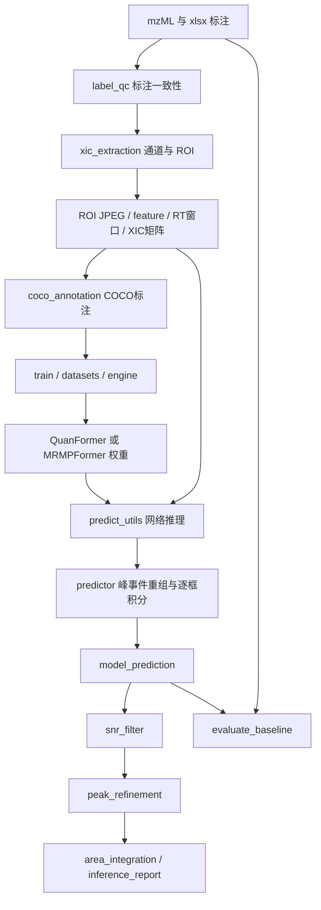

# 峰识别项目理解与后续改进基线

审阅日期：2026-09-08；最新规范同步日期：2026-09-10。范围：`D:/yinlibo/MRMPFormer/model`，参考父目录 README、依赖文件及最新工程文档。本文记录当前代码行为，不能用历史 README 或配置注释替代它。未修改业务代码、配置、标注或权重。

## 0. 最新工程文档基线（2026-09-10同步）

后续工作以 `D:/yinlibo/MRMPFormer/docs/峰识别工程_整理扩充版.md` 为产品与工程规范基线。本次完整阅读的文档为 369 行、SHA256 `1EFC481532A0E274551E476D383F70A9474C0C5426502BBBE74B26B4F588F3CC`。如果该文件内容或哈希变化，应先重新同步本节，再设计或评估改动。

解释顺序固定如下：

1. 文档第1.1节描述整理时的历史现状；
2. 文档第1.2节及以后描述重构目标和后续统一口径；
3. 标为“补充建议”或“待确认”的条目属于设计候选，不能宣称源码已实现；
4. 回答“当前程序怎么运行”时以源码和实际配置为准；回答“项目应该改成什么”时以该文档目标为准；两者冲突时明确列出差距，不静默选择其中一个。

文档确立的工程边界：项目由前处理、训练、推理、后处理、评估五个模块组成，并编排为训练线、推理线、评估线；QC1—QC5是跨阶段检查机制。模型原始能力评估只使用原始候选和QC3，不允许QC4/SNR或QC5/精修修改预测后再冒充原始模型指标。部署后处理结果应另做精修前后对照。

后续必须保持的评价口径：在同一样本、同一通道及对应ROI内先按模型分数阈值筛选，再要求预测起点和终点的绝对RT误差均不超过容差，并做一对一匹配；剩余预测计FP，剩余GT计FN。报告同时保留TP/FP/FN、P/R/F1、边界误差、面积口径、特殊峰子组、空白样FP和QC排除清单。阈值、容差、权重、数据与标签版本、是否参与训练、结果阶段均属于实验身份，不能省略。

置信度字段必须区分：`score_ai`是模型输出；`main_conf_composite`是AI、SNR、RT和偏度的规则加权分；`main_conf_final`是AI乘RT非线性衰减、SNR因子和偏度因子的最终规则分；`final_conf_best`用于兼容汇总；`need_manual_review`是复核状态。规则分未经校准，不能解释为真实正确概率。峰面积是独立输出，不参与当前置信度公式。

本次对照源码确认的主要未同步项如下。它们是后续重构清单，不在本次阅读任务中直接修改业务行为。

| 规范目标 | 2026-09-10源码行为 | 结论 |
|---|---|---|
| QC1默认RT容差0.5 min | `inference/cli.py`默认1.0 min | 尚未同步 |
| QC2：最高强度<1500且点数<20时拒绝，AND逻辑 | 默认1000/10，两个检查顺序独立执行，任一不达标即拒绝 | 尚未同步，语义差异较大 |
| `roi`支持`input_type=file/data`，存在统一时序JSON data入口 | CLI当前无`input_type`，`roi/pipeline`仍要求mzML和labels | 尚未实现目标接口 |
| `prediction_model`与实验根目录内`qc/` | 当前使用`predictions_model`及独立`output/QC/<run_name>/` | 目录规范尚未迁移 |
| 原始模型评估保留阈值前全部候选 | pipeline默认先做事件重组，并有0.05候选分数地板 | 需要定义并保存真正raw候选层 |
| 一对一匹配先最大化命中数，再最小化总边界误差 | `evaluate_baseline.match_image`按预测分数顺序贪婪匹配，每个预测内部选最小误差GT | 基本口径一致，全局最优策略尚未实现 |
| 训练保存最佳权重和末轮权重 | 当前固定保存checkpoint及周期权重，未见按最佳验证指标自动保存best | 尚未同步 |
| 统一报告路径与完整字段 | 当前已有推理/评估报告和多类QC表，但命名、目录及部分阶段字段仍是历史结构 | 需要迁移并保留兼容读取 |

已经与文档吻合或基本吻合的实现包括：四种推理模式；标注驱动ROI；400×300图像及像素—RT映射；MRMPFormer的ResNet-50、1层Encoder、3层Decoder和FDR logits残差；多query与多峰输出；框外SNR及精修后SNR；1.08倍预测宽和0.45倍ROI宽限制；主/次峰复核；复合与最终置信度；起止边界容差式评估；MassNova整谱候选、可选模型验证及信号回退。

## 1. 覆盖范围与证据

本次目录快照共 276 个文件：119 个 Python 文件（31,543 行）、19 个 JSON 配置、6 个 PTH 权重、1 个 R 文件、9 个 IDE 配置文件、122 个 Python 字节码缓存。Python AST 共提取 966 个类、函数、方法及嵌套定义。

- `FILE_INDEX.md`：逐文件职责提示、符号及行号、配置实际值。
- `file_inventory.json`：完整文件清单、文本 SHA256、全部 Python 导入、函数签名、文档字符串、调用名称集合。调用集合是静态语法索引，不是完整运行时调用图。
- `checkpoint_metadata.json`：6 个实际权重的 args、epoch、state_dict 键、张量形状及 dtype。
- 本文：主链路人工核对、实现约定、模型差异、改进影响范围和验证边界。

覆盖深度需要区分：全目录完成清点和文本/语法结构扫描；核心训练、模型、ROI、推理、SNR、积分及评估路径做了重点交叉阅读；工具脚本建立了职责和入口索引。没有逐个执行所有工具、所有精修分支或全量真实数据实验，不能将“有索引”理解为“所有细节均已验证”。后续修改某条支路时，应沿索引再次核对其完整实现及调用方。

## 2. 项目的实际问题定义

这是 LC-MS/MRM 色谱峰识别与定量项目。主模型输入是 XIC 渲染的图像，不是原始一维时序；输出为峰概率和二维检测框。二维框的 x 轴对应 RT，积分只使用左右边界。当前 COCO 标注的 y 轴固定为整幅图像，因此主要学习任务是峰存在性、峰数量和时间边界。

主线有两种不同的搜索条件：

1. **标注驱动 pipeline**：先用标注中的化合物、通道、RT 定位 ROI，再检测窗口内峰。窗口中心有先验，不代表完全无标注整谱搜索。
2. **MassNova**：遍历有效 chromatogram，在全谱上枚举信号候选，再切窗调用模型；未命中模型的候选仍可能经信号兜底被保留。

`ion_zenith.py` 是 MS1 质荷比聚合/最大强度提取算法，与 MRM 峰框检测属于不同任务。

## 3. 模块关系

| 目录/文件 | 责任 | 改动会影响什么 |
|---|---|---|
| `train.py` | 参数、设备、优化器、恢复/迁移、训练循环、权重与日志 | 实验可复现性、学习率、续训语义 |
| `framework/datasets` | COCO读取、bbox转换、图像归一化、COCO评估 | 训练/验证输入一致性及 AP |
| `framework/engine.py` | 前向、损失加权、AMP、反向、验证与日志 | 损失生效和指标记录 |
| `framework/util` | NestedTensor、分布式、框运算、日志过滤 | 全模型共享接口 |
| `models/quanformer` | 单层基线 DETR 与标准 Transformer | 历史权重和基线 |
| `models/mrmpformer/v1` | FDR模型、边界反馈、损失和特殊峰实验 | 核心算法 |
| `models/shared` | ResNet、位置编码、Hungarian匹配、分割遗留模块 | 模型公共部件 |
| `preprocessing` | 标注解析/QC、真实和模拟COCO、ROI、掩蔽、MS1天顶 | 数据分布及通道身份 |
| `inference/cli.py` | pipeline / roi / roi2inference / massnova调度 | 参数透传、目录、QC、报告 |
| `inference/predictor.py` | 预测、XIC对齐、峰事件重组、积分、图表 | 网络输出到业务峰表 |
| `inference/peak_event_merge.py` | 重叠去重、谷底合并、足点重划 | 宽峰/开叉峰口径与普通峰边界 |
| `inference/two_round_detection.py` | 主峰掩蔽后二次模型识别；共享边界行走 | 次峰召回、精修、MassNova兜底 |
| `postprocessing` | SNR、边界与主次峰、谷拆分、面积 | 最终检测和定量 |
| `tools/evaluation` | 基线、模拟、特殊峰、消融、FDR轨迹、报告 | 指标口径及研究证据 |
| `tools/diagnostics` | 框→RT、SNR/XIC对齐、单案例追溯 | 定位坐标和数据错配 |
| `tools/experiments` | 江南/欧陆对照、面积比、化合物覆盖 | 实验分析，不是核心模型 |
| `tools/benchmark` | 重复运行、CPU/内存/GPU采样、聚合 | 性能证据 |
| `tools/maintenance` | 数据抽样、强制空白负例、重建XIC、结果整理 | 会改写数据或产物，非日常推理 |
| `tools/mzml`、`tools/visualization` | 查看导出色谱、预测/GT/精修可视化 | 数据检查和展示 |
| `tools/_shared` | 表读取、chrom JSON、产物定位 | 工具层复用 |
| `tools/export_onnx.py` | 网络导出与数值对齐验证 | C/C++部署接口 |
| `.idea` | Python3.11项目配置、CSV、IDE检查与历史QuanFormer名称 | 不参与算法 |
| `utils/find_peaks.R` | 全部代码注释，已禁用 | 不能按旧README认为仍在运行 |
| `__pycache__` | 自动生成字节码 | 不作为算法源码依据 |

所有具体文件和每个函数的位置见 `FILE_INDEX.md`；本文不重复整份符号表。

## 4. 输入数据与坐标契约

### 4.1 真实数据标注

`parse_labels_xlsx` 使用 ZIP/XML 标准库读取 `sheet1.xml`，按列字母对齐稀疏单元格。支持原始拼写 `comonent` 和 `component`，映射为 `compound`。`channel` 中“定量”映射 `-1`，“定性”映射 `-2`。RT 可解析 `16.428(0.000)` 形式的数值前缀。

`peak_label=0`：生成负例图、不生成框；`1`：正例；缺失标签按兼容路径处理；其他值过滤。最多读取 `peak_start1..3/peak_end1..3`，缺失时回退旧单峰字段。合法正例无有效区间时，也可能作为无框图进入数据集。

样品映射优先显式 `sample_map`，其次带 `.mzML` 后缀的 sample_id 文件名匹配，最后按出现顺序。多实验旧式 sample_id 加实验名前缀。不能默认文件排序与标注样品顺序总能一致。

### 4.2 ROI生成

- 真实 mzML 路线通过 pyopenms 读 chromatogram。`getRT()` 数据在此路线明确除以 60 转分钟。
- native_id 优先从原文件字节/XML恢复，以绕过部分中文解码问题；Q1/Q3先尝试ID文本，再回退元数据。
- 仅当 Q1、Q3 均缺失时作 TIC 类剔除；去重键含 Q1、Q3、native_id，避免不同化合物共享离子对时误合并。
- 可选一维 Gaussian 平滑，sigma 是采样点尺度。
- 标注驱动使用标注 RT 居中，通常 ±1 min，裁到该通道数据范围。底层函数在 labels 未提供或为空列表时仍允许通道驱动路径。
- 渲染固定 400×300 JPEG，无坐标轴、固定 xlim。与训练共用 `render_roi_jpeg`。

### 4.3 四种产物必须一并理解

| 文件 | 关键结构 |
|---|---|
| ROI JPEG | `N_mz..._q3..._化合物.jpeg`；N为原ROI列表1-based序号 |
| `feature.csv` | `Compound Name`（序号）、`native_id`、`mz`、`q3`、`RT` |
| `roi_windows.csv` | `image, rt_lo, rt_hi`，窗口单位为分钟 |
| `xic_matrix.npy` | `[N+1,S]`；第0行为公共RT轴，后N行为对应强度 |

真实 mzML ROI 路线以**第一个保留通道**的 RT 作为公共轴，其余通道插值，范围外填0。原ROI渲染使用各自的原生RT轴，未必与矩阵公共轴覆盖范围相同。SNR阶段另建全局范围统一轴，且按通过的预测行重新压缩编号；它不是原ROI矩阵的简单子集。

像素映射：`t = rt_lo + x/400 × (rt_hi-rt_lo)`。标注COCO是像素 `xywh`；数据集转换后为归一化 `cxcywh`；模型输出亦是 `cxcywh`；推理再转像素 `xyxy`。最终积分不使用 y。

真实COCO框为 `[x_start, 0, width, 300]`。完全在窗外的峰跳过，裁剪后宽度 <1px 的峰跳过。COCO类别编号为0，不是通常例子里的1。

### 4.4 模拟数据路线

`coco_annotation_sim.py` 读取 `xic_data/*.json` 与 `label/label.csv`，以 `(sample_id,compound_id,ion_type)` 关联。单峰用 peak_position1、多峰用首末边界中点、负例用 argmax 居中；宽峰/多峰会扩窗。按完整样品抽验证集，默认配置抽10个样品，种子61002。

真实训练构建配置平滑为0，当前推理配置为0.8；模拟扩窗与真实固定±1min也不同。它们是已确认的输入分布差异，是否影响性能须实验验证。

## 5. 模型细节

### 5.1 QuanFormer

当前主要配置：ResNet50、1层encoder、1层decoder、3个query、hidden_dim256、8头attention、FFN2048。以最后一层特征经线性分类头和3层bbox MLP输出，bbox过sigmoid。

模型工厂使用 `args.model` 路由。QuanFormer实际 Criterion 为 CE + L1 + 配置选择的IoU损失；即使通用配置中存在 `classification_loss=focal`、FDR、动态L1字段，也不意味着基线使用这些损失。

ResNet使用FrozenBatchNorm。默认 `lr_backbone>0` 时仅 layer2/3/4可训练，stem/layer1冻结。构建时 `pretrained=is_main_process()` 会请求ImageNet预训练；所以 `resume=null` 的“从零训练”仍可能加载ImageNet骨干，不能理解为全网络随机初始化。MobileNet类虽存在，当前 `build_backbone` 直接构造ResNet式Backbone。

### 5.2 MRMPFormer v1（v3配方也走此结构）

- 第1层decoder预测完整初始框 `b0=(cx,cy,w,h)`。
- 每层独立FDR MLP输出 `[B,Q,2,N]`，左右各N个bin；默认N=33。
- 默认bin：`u=linspace(-1,1,N)`、`W=sign(u)*abs(u)^2`，中心更密。
- 第1层得到z1，之后累计logits：`zk=z(k-1)+delta_zk`。
- 解码：`dx=s0*sum(softmax(zk)*W)`；默认s0为初始框宽度。每层都相对**相同初始左右边界**解码，不再把坐标增量重复累加。
- 精化后的左右边界经 `BoundaryPositionMLP` 反馈下一层query位置：base query位置 + 本层边界编码。默认梯度不断开。
- 最终左右来自最后层，上下仍来自初始框；宽度clamp至至少1e-4，但未把所有坐标强制裁到[0,1]。
- 最终分类只来自最后层；分类头各层共享。
- FDR末层零初始化，初始均匀分布的期望偏移近0。

输出除 `pred_logits/pred_boxes` 外，还保留 initial_boxes、initial_edges_ltrb、累计fdr_logits、fdr_logits_own、fdr_deltas、refined_lr及可选aux_outputs，便于逐层诊断。

实验开关还包括 `roi_width` 尺度、`fdr_cascade`（以上一层边界为锚点解码本层own logits）、逐层Gaussian监督宽度、目标进度分解、反馈detach。这些需要同时核对模型和Criterion，不能只改forward。

### 5.3 损失与匹配

- Hungarian一对一匹配：类别负概率 + 普通L1 + 选定IoU成本，常见权重1/5/2。Matcher并未使用动态L1或PW-CIoU加权中心项。
- 分类：含显式背景的Softmax Focal，前景alpha0.25、gamma2、背景额外eos0.1。
- 动态L1：`lambda_c=1/(w_gt+eps)`，同时乘cx和cy误差，宽高权重另外配置。
- PW-CIoU：中心距离项乘训练集平均峰宽/GT峰宽；平均宽必须与数据集对应。真实配置0.1273，模拟配置0.3958。
- FDR：相邻两个bin插值软标签交叉熵，按层/左右边界加权。默认层权重0.5/0.7/1，FDR总系数2。代码明确这是工程分布监督实现，不能直接声称复现论文FGL原式。
- 辅助层当前主要增加分类损失；不能因为存在aux_boxes就认定它们都接受完整bbox辅助损失。
- 日志包含逐层边界MAE/IoU、分布越界率、无效框比例、GT超过query比例、匹配正样本数等。
- `recall_loss_enabled=true` 明确抛NotImplementedError。

### 5.4 特殊峰分支

`detr_special.py` 复用模型结构，覆盖分类和定位损失。special_v1使用质量分类与log宽度L1；special_v2配置中 `special_cls=focal`，不能仅按类名判定仍在用QFL。log宽度项为参考宽×`abs(log(w_pred)-log(w_gt))`，中心权重默认 `1/sqrt(w_gt)`。质量分类实现的正例是soft-target BCE形式，负例乘概率gamma，不应直接用通用QFL名称推断完整公式。

## 6. 训练与权重身份

训练使用AdamW：主干和其他参数分学习率，StepLR，梯度裁剪；CUDA可开启AMP/TF32/cudnn benchmark。种子为配置seed+rank。训练batch drop_last=True。

`resume`恢复模型；不reset_optimizer时还恢复optimizer/scheduler和epoch。微调reset_optimizer跳过优化器恢复。旧QuanFormer→MRMPFormer迁移会将decoder第1层复制到新增层，FDR保持新初始化。迁移专门分支目前判断 `args.model == mrmpformer_v1`，special不走同一分支。

每轮保存checkpoint.pth、运行验证并追加log.txt；额外权重实际是每10轮及LR下降前保存，注释“every 5”已落后。没有看到按最佳验证指标自动保存best checkpoint的实现。

| 实际权重 | args.model | 保存epoch（0-based） | 数据/训练身份 |
|---|---|---:|---|
| `mrmpformer.pth` | mrmpformer_v1 | 29 | traindatav1，输出目录mrmpformerv3 |
| `mrmpformer_trainv2.pth` | mrmpformer_v1 | 29 | traindatav2，平均峰宽0.3958 |
| `mrmpformer_special_v2.pth` | mrmpformer_special | 21 | traindatav1，接special_v1权重 |
| `quanformer.pth` | 缺省，加载回退quanformer | 29 | 历史Windows数据路径peak-all |
| `quanformerv2.pth` | quanformer | 19 | traindatav1_sub1000，旧基线微调 |
| `quanformerv3.pth` | quanformer | 29 | traindatav1，resume为空 |

v3_rebuild是当前配置文件之一，不能从文件名推断默认权重已更新到该配方。权重args只能证明保存时记录的身份，不能独立证明历史数据内容或实验效果。

## 7. 推理和后处理真实行为

### 7.1 网络推理

`utils/predict_utils.py` 使用RGB、ToTensor、ImageNet Normalize，不Resize，与COCO训练变换相同。逐张图推理，类别0概率严格 `> threshold` 才保留。`build_predictor` 从checkpoint.args重建模型；缺args无法正常重建；strict=False加载会打印missing/unexpected。批处理每个样品可重复构建和加载模型。

扫描jpg/jpeg时按stem、再按N_mz序号去重。这符合单样品目录约定，不适合把不同样品同N序号的图混在一个递归扫描根下。

### 7.2 峰事件重组默认开启

`predictor.run_single` 默认 `disable_event_merge=False`。高阈值场景先以score_floor0.05保留候选，之后：

1. 重叠达到较短区间60%的框按score去重。
2. 两个apex之间谷底/较矮峰高 > fork_frac0.35时合并，score取最大值。
3. 足点阈值为max(基线+noise_k×noise, foot_frac×apex)，默认foot_frac0.02，边界最多额外延展0.35min。
4. 按最终阈值 `>=` 筛事件，再转回像素框。

**当前 `_foot_rebound` 实际处理所有剩余事件，并未按merged标志限制；模块顶部“仅合并事件改变边界”的说明与实现不同。** 因此“网络query数”“事件数”“最终精修峰数”不是同一指标。

### 7.3 原始预测表与积分

每图保留多个query，每个框独立生成峰行；无检测的通道生成score0、面积0、框NaN的占位行。输出起止字段为 `peak_start/peak_end`，峰顶字段为 `retention_time`。`peak_index`按图内RT排序。

当前 `_integrate_each_predicted_box` 不输出q3列，因此run_single里旧 `(mz,q3)` 最大面积去重分支通常不进入；不能只读注释认定多峰被该分支丢弃。

特别注意：pipeline传 `baseline_correction=False`。因此即使 `integration_method=linear`，该表实际走raw梯形积分，`integration_method_used`却可能仍记录linear。最终报告另外以SNR积分补算精修面积。比较面积时必须确认执行分支，而非只看标签。

### 7.4 SNR和精修

`snr_filter` 重新读取mzML并平滑，以**全色谱预测框外**强度均值和RMS标准差计算 `(框内最大值-框外均值)/noise_rms`。至少5个噪声点，通常阈值10。

`utils.xic_peak_utils.compute_snr_outside_box` 则使用邻近左右噪声的峰峰差，公式为 `2*(peak-baseline)/max(noise_pp_left,noise_pp_right)`。MassNova还使用local SNR。不同字段里的SNR不能未经校准直接互换阈值。

`peak_refinement.py` 共4119行，覆盖post_newtest、standard、sample、predict_from_standard_rt四类入口。默认post_newtest会选主峰、校正边界、防峰顶漂移、识别模型小峰/ROI额外峰/主峰谷拆分、必要时左右信号再搜索，最终可记录main和small/small2/small3。共享边界算法支持ROI低10%均值、稳定尾部均值、单侧低分位，支持后验连续点与相邻峰约束、宽度限制、三连微降早停。

`gate_ok_for_adjustment`在默认post_newtest路径中会记录为输出标志；低于min_confidence不等价于整行一定被删除，主峰修正调用在代码中仍可继续。报告中的“QC5门控”需要区分诊断标志和实际过滤行为。

`two_round_detection`独立入口才是“掩蔽ROI→再次调用模型”的流程。精修中的 `lr_repredict` 有信号侧搜索逻辑，名称不代表又执行一次神经网络。

### 7.5 MassNova与ONNX

MassNova实际顺序是候选枚举→模型前置验证→仅对未命中候选进行信号边界/SNR/面积兜底→去重与最终指标。可选CentWave候选器从父目录相关模块加载；该路径与已注释的R脚本不同。模型接受的框与信号兜底框分别标记boundary_source。

ONNX包装内置 `/255 + Normalize`，输入float32 `[B,3,H,W]`但值域0..255；`img_size=[W,H]`；输出scores、boxes_xyxy、boxes_norm。不包含pipeline事件合并/SNR/精修规则。脚本提供Torch/ORT数值验证；当前环境未找到onnx包，本轮未运行导出。

## 8. 评估口径

训练验证：COCO bbox AP。`evaluate_baseline.match_image`实际检测规则：预测起点和终点与GT的绝对偏差均 <= tolerance，按score顺序贪婪一对一配对。**文件顶部写的tIoU阈值说明已陈旧。**

严格未匹配的预测与GT可按quant_tolerance再作宽松定量配对。主evaluate通过 `fn += len(fns)+len(loose)` 保持严格检测FN；宽松配对仍是FP/FN，只加入面积/RT定量统计。match_details中宽松GT没有单独FN行，因此直接数明细表FN不一定等于汇总FN。

面积R²来自对manual_area与pred_area重新拟合直线，不是强制y=x的绝对一致性：存在固定倍数偏差时也可很高。RSD按native_id跨样品的预测面积计算，只有相同浓度/可比进样才能直接解释为重复性。

评估遍历feature.csv中的通道，ROI生成前已排除或未成功生成的通道不会自动进入完整GT召回分母。标注驱动检测评估、全量标注端到端召回和MassNova整谱召回需要分别定义。

默认pipeline事件重组会影响model_prediction。直接 `build_predictor` 的query诊断、模拟评估路径与pipeline峰表不一定经过相同处理。模型对比应固定是否开启event_merge、ROI、平滑、阈值、匹配容差、QC和积分方法。

## 9. 已识别的具体问题与待验证点

以下为阅读成果，不在本轮修改算法。

| 项目 | 证据与含义 | 状态 |
|---|---|---|
| 事件重组说明落后 | `_foot_rebound`对全部事件重划，且默认开启 | 代码确认；实际效果待分层消融 |
| QC排除粒度 | cli将样品级排除记录压成native_id全局字典，复用于所有样品；训练侧按样品标记 | 代码确认；应核对正常样品是否被连带剔除 |
| 公共RT轴覆盖 | 初次ROI用首通道轴，后续通道域外插值0，原图仍用原轴 | 代码确认；scheduled MRM影响需逐数据核对 |
| 空结果与复用目录 | ROI全剔除不重写npy；SNR无通过行不生成新prediction_snr；旧产物可能残留 | 代码确认触发条件，未执行旧目录复现 |
| ROI缓存失效策略 | 真实COCO仅靠feature和windows存在判断复用，无标注/参数指纹 | 代码确认 |
| 数据划分 | val_stems按mzML组；val_ratio走ROI随机划分，不能把两者都称样品隔离 | 代码确认 |
| 积分标签与行为 | pipeline禁用baseline_correction，但可标记linear | 代码确认 |
| SNR定义不同 | RMS / peak-to-peak / local多套实现 | 代码确认，需单独解释阈值 |
| 平均峰宽回退 | MRMPSetCriterion缺bar_w时警告“权重1”，但实际设bar_w=1后仍除w_gt | 代码确认；默认生产配置非空，主要影响缺字段配置 |
| 特殊分支空batch | QFL且全背景时loss_labels不返回class_error，而engine直接索引该键 | 代码确认；特殊分支未被现有57项完整覆盖 |
| 维护脚本失效导入 | regenerate_xic导入不存在的extract_xic_from_chrom_json_dir | 静态导入扫描发现 |
| XLSX兼容性 | 主解析器无条件读取sharedStrings.xml，未覆盖inlineStr工作簿 | 代码确认限制 |
| 历史RT单位启发式 | 多处maxRT>200才转秒；MassNova另以步长>=0.1判秒 | 代码确认，短运行/长时间分钟轴需边界验证 |
| 离子天顶计数 | 新最高强度覆盖best记录时n_observations重置1 | 代码确认，影响观测次数字段 |
| MassNova局部基线开关 | enumerate_peaks中local_valley和其它分支目前计算同一分位数 | 代码确认 |
| 路径陈旧 | 部分baseline/finetune配置引用不存在的data/test/coco、test1_ft、merged等 | 本机存在性核对 |

配置中的0.01推理阈值、0.99后处理置信度字段、0/0.8平滑差异是实际值；未经确认不能替用户改回注释默认值。

## 10. 后续改进的影响清单

| 想改什么 | 必须一起看 |
|---|---|
| 峰边界精度 | GT起止口径、FDR目标范围、动态L1/PW-CIoU、事件足点与后精修 |
| 弱峰召回 | query数/背景权重/阈值、ROI前QC、SNR定义、次峰恢复和漏检分母 |
| 宽峰/开叉/肩峰 | GT定义为包络还是多个峰、event_merge、valley_split、模拟扩窗 |
| 泛化和模拟数据迁移 | 样品隔离、真实/模拟窗宽和平滑差异、bar_w统计、空白标签策略 |
| 定量准确性 | 原生RT采样、通道对齐、边界、基线、×60单位和线性拟合R²的含义 |
| 推理速度 | 每样品重复权重加载、逐图batch1、重复mzML加载、渲染/磁盘IO |
| 部署 | ONNX输入预处理、固定query数、动态shape、网络与Python规则层边界 |

改进前应保存可重现基线：权重身份、源码快照、数据/标注版本、split列表、ROI参数、阈值、QC、是否事件重组和指标口径。这里的目的不是预先决定改哪个模块，而是保证收益归因可靠。

## 11. 本轮验证及边界

- 解释器：终端默认Python3.14.6；实际检查和测试使用 `D:/miniconda/envs/gamstekpeaking/python.exe`，Python3.11.15。
- PyTorch2.6.0+cu124，CUDA可用；主要依赖可定位。
- 命令：`python -B -m unittest tests.test_mrmpformer_v1 tools.tests.test_shared`（使用上述3.11解释器）。结果：57 tests，22.007s，OK。
- 测试包括模型shape、残差、分布解码、最终框/分类来源、反馈梯度、空目标及损失、旧权重迁移、小样本过拟合、共享工具解析等。DummyBackbone测试通过不等于完整ResNet+真实mzML管线验收。
- 119个Python文件均成功AST解析。Python3.14对两个历史文档字符串中的Windows反斜杠发出SyntaxWarning，未作源码修改。
- 6个PTH通过weights_only读取，并仅允许Namespace元数据；保存元数据，不反序列化为“新的最佳模型”结论。
- 未重训、未改标注、未覆盖权重、未执行维护脚本、未导出ONNX、未重跑全量实验。父目录的桌面端、C++和转换器不属于本轮全目录审阅范围，只识别其接口关系。

后续会以这份记录为基础定位改动；涉及尚未逐分支验证的工具或精修逻辑时，继续核对源码和具体案例，不假设已经掌握未验证的实验事实。
